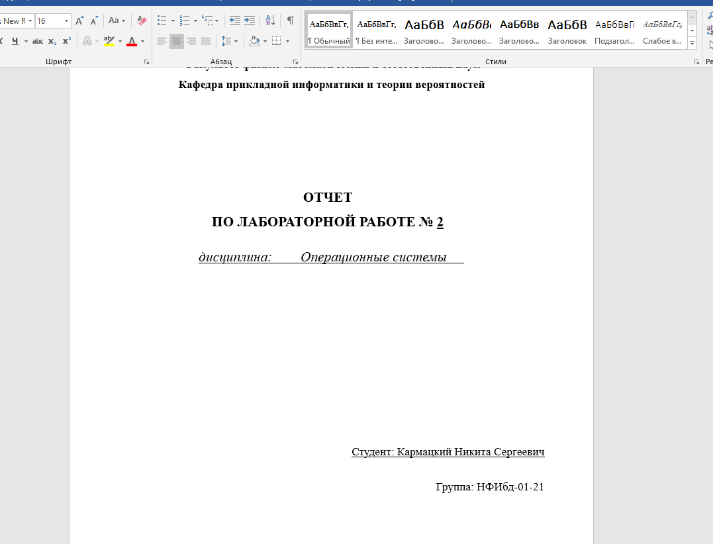
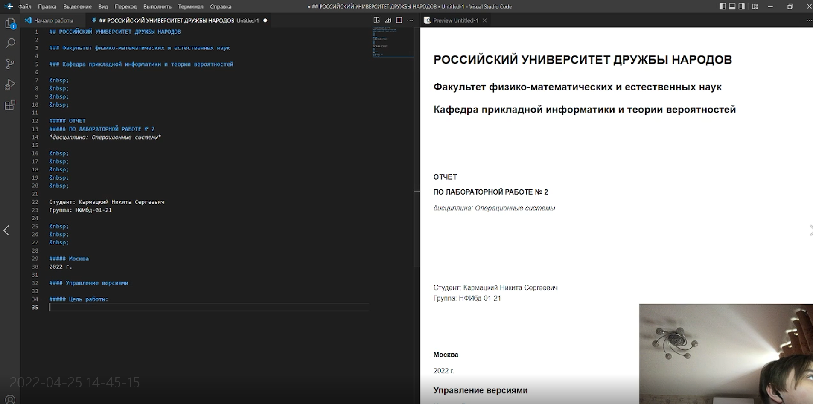
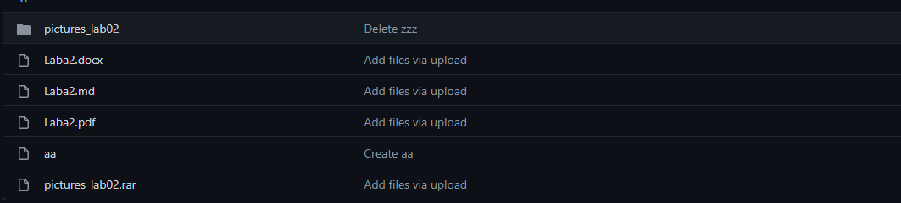

## РОССИЙСКИЙ УНИВЕРСИТЕТ ДРУЖБЫ НАРОДОВ

### Факультет физико-математических и естественных наук

### Кафедра прикладной информатики и теории вероятностей

&nbsp;

&nbsp;

&nbsp;

&nbsp;

&nbsp;

&nbsp;

&nbsp;

##### ОТЧЕТ
##### ПО ЛАБОРАТОРНОЙ РАБОТЕ № 3
*дисциплина: Операционные системы*

&nbsp;

&nbsp;

&nbsp;

&nbsp;
&nbsp;
&nbsp;
&nbsp;
&nbsp;

&nbsp;

Студент: Кармацкий Никита Сергеевич

Группа: НФИбд-01-21

&nbsp;

&nbsp;

&nbsp;

&nbsp;
&nbsp;
&nbsp;
&nbsp;

##### Москва
2022 г.

&nbsp;
&nbsp;
&nbsp;
&nbsp;&nbsp;
&nbsp;&nbsp;
&nbsp;&nbsp;
&nbsp;&nbsp;
&nbsp;

## Markdown

### Цель работы:

Научиться оформлять отчёты с помощью легковесного языка разметки Markdown.

### Теоретическое введение

#### Базовые сведения о Markdown:

Чтобы создать заголовок, используйте знак ( # ), например:

1} # This is heading 1

2} ## This is heading 2

3} ### This is heading 3

4} #### This is heading 4

Чтобы задать для текста полужирное начертание, заключите его в двойные звездочки:

This text is (** ) **bold**(**).

Чтобы задать для текста курсивное начертание, заключите его в одинарные звездочки:

This text is (* )*italic*(*).

Чтобы задать для текста полужирное и курсивное начертание, заключите его в тройные звездочки:

This is text is both (*** )***bold and italic***(***).

Неупорядоченный (маркированный) список можно отформатировать с помощью звездочек или тире:

1} - List item 1

2} - List item 2

3} - List item 3

#### Обработка файлов в формате Markdown

Для обработки файлов в формате Markdown будем использовать Pandoc
https://pandoc.org/. Конкретно, нам понадобится программа pandoc ,
pandoc-citeproc https://github.com/jgm/pandoc/releases, pandoc-crossref
https://github.com/lierdakil/pandoc-crossref/releases.

Преобразовать файл README.md можно следующим образом:

1} pandoc README.md -o README.pdf

или так

1} pandoc README.md -o README.docx

### Ход работы:

1. Откроем отчет по Лабораторной работе №2, который был сделан в DOCX.

Рис.1: Открыли отчет в DOCX

2. Сохранили все скриншоты из отчета в гитхаб.

Рис.2: Cкришоты старого отчета в GitHub

3. Начинаем писать отчет в Markdown в программе Visual Studio Code.

Выбрал я эту программу из-за ее удобства и простоты использования.

Рис.3: Создание отчета с раширением .md в Visual Studio Code

4. После завершения написания нашего отчета сохраняем его с раширение .md в любую для нас удобную папку

Рис.4: Сохрание отчета в папку в Windows

Писали мы все в Windows, но потом для конвертирования перенесли все в Linux Fedora

Рис.5: Наш отчет уже в Fedore

5. Конвертируем наш отчет в PDF и DOCX с помощью Pandoc.

Рис.6: Конвертация нашего отчета в DOCX и PDF

Рис.7: Наши отчеты в PDF, DOCX, MD

1. Загружаем наши отчеты на Git Hub.

Рис.8: Загруженные отчеты на Гит

## Вывод: 

Мы научились оформлять отчёты с помощью легковесного языка разметки Markdown.

