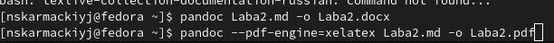

# Лабораторная работа №3

## "Markdown"

Выполнил: Кармацкий Никита Сергеевич

НФИбд-01-21

___

# Цель работы:

Научиться оформлять отчёты с помощью легковесного языка разметки Markdown.

# Поставленные задачи:

1. Изучить язык разметки Markdown
2. Сделать отчёт по предыдущей лабораторной работе в формате Markdown.
3. В качестве отчёта предоставить отчёты в 3 форматах: pdf, docx и md (в архиве,
поскольку он должен содержать скриншоты, Makefile и т.д.)

___

# Что такое Markdown?

Markdown (произносится маркда́ун) — облегчённый язык разметки, созданный с
целью обозначения форматирования в простом тексте, с максимальным
сохранением его читаемости человеком, и пригодный для машинного
преобразования в языки для продвинутых публикаций (HTML, Rich Text и других).

___

# Базовые сведения о Markdown

Чтобы создать заголовок, используйте знак ( # ), например:

1} # This is heading 1
2} ## This is heading 2
3} ### This is heading 3
4} #### This is heading 4

___

Чтобы задать для текста полужирное начертание, заключите его в двойные
звездочки:

- This text is **bold**.

Чтобы задать для текста курсивное начертание, заключите его в одинарные
звездочки:

- This text is *italic*.

Чтобы задать для текста полужирное и курсивное начертание, заключите его в
тройные звездочки:

- This is text is both ***bold and italic***.

Неупорядоченный (маркированный) список можно отформатировать с помощью
звездочек или тире:

1} - List item 1
2} - List item 2
3} - List item 3

___

# Основные этапы выполнения работы

___

## 1. Откроем отчет по Лабораторной работе №2

Рис.1: Отчет в Word

___

___

## 2. Сохранили все скриншоты из отчета в гитхаб.

Рис.2: Cкришоты ЛБ2 отчета в GitHub

___

3. Начинаем писать отчет в Markdown в программе Visual Studio Code.

Рис.3: Создание отчета с раширением .md в Visual Studio Code

___ 

## 4. После завершения написания нашего отчета сохраняем его с раширение .md в любую для нас удобную папку

Рис.4: Сохрание отчета в папку в Windows

___

Писали мы все в Windows, но потом для конвертирования перенесли все в Linux Fedora

Рис.5: Наш отчет уже в Fedore

___

5. Конвертируем наш отчет в PDF и DOCX с помощью Pandoc.

Рис.6: Конвертация нашего отчета в DOCX и PDF

___

Рис.7: Наши отчеты в PDF, DOCX, MD

___

6. Загружаем наши отчеты на Git Hub.

Рис.8: Загруженные отчеты на Гит

___

## Вывод: 

Мы научились оформлять отчёты с помощью легковесного языка разметки Markdown.

___
# Спасибо за внимание