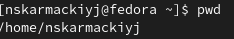
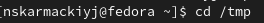
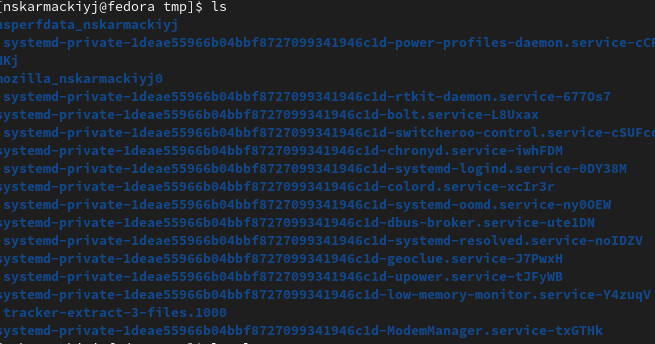
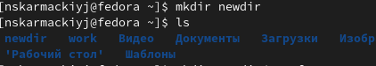
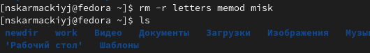
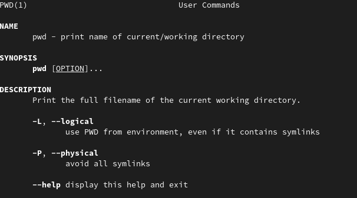
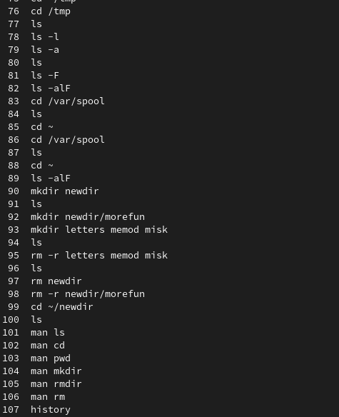

# Лабораторная работа №4

**"Основы интерфейса взаимодействия пользователя с системой Unix на уровне командной строки"**

Выполнил: Кармацкий Никита Сергеевич

НФИбд-01-21

___
## Цель работы:
Приобретение практических навыков взаимодействия пользователя с системой посредством
командной строки.
## Поставленные задачи:
1. Приобрести практические навыки взаимодействия с командной строкой.
2. Выполнить определенные задания на знания простых команд.

___

## Теоретическое введение
В операционной системе типа Linux взаимодействие пользователя с системой обычно осуществляется с
помощью командной строки посредством построчного ввода команд. При этом обычно используется
командные интерпретаторы языка shell: /bin/sh; /bin/csh; /bin/ksh.
Формат команды. Командой в операционной системе называется записанный по специальным
правилам текст (возможно с аргументами), представляющий собой указание на выполнение какойлибо функций (или действий) в операционной системе. Обычно первым словом идёт имя команды,
остальной текст — аргументы или опции, конкретизирующие действие. Общий формат команд можно
представить следующим образом: <имя_команды><разделитель><аргументы>

___

Команда man. Команда man используется для просмотра (оперативная помощь) в диалоговом режиме
руководства (manual) по основным командам операционной системы типа Linux. Формат команды:
 - man <команда> 

Команда cd. Команда cd используется для перемещения по файловой системе операционной системы
типа Linux. Формат команды:
 - cd [путь_к_каталогу]

Команда pwd. Для определения абсолютного пути к текущему каталогу используется команда pwd
(print working directory).
- pwd

___

Команда ls. Команда ls используется для просмотра содержимого каталога. Формат команды:
- ls [-опции] [путь]

Команда mkdir. Команда mkdir используется для создания каталогов. Формат команды:
- mkdir имя_каталога1 [имя_каталога2...]

Команда rm. Команда rm используется для удаления файлов и/или каталогов. Формат команды:
- rm [-опции] [файл]

___
Команда history. Для вывода на экран списка ранее выполненных команд используется команда
- history

Выводимые на экран команды в списке нумеруются.
К любой команде из выведенного на экран списка можно обратиться по её номеру в списке,
воспользовавшись конструкцией:
- !<номер_команды>.

___

## Основные этапы работы
**1.** Определим полное имя нашего домашнего каталога. Сделаем это с помощью команды pwd

Рис.1 Имя нашего домашнего каталога

___

**2.** Перейдем в каталог /tmp с помощью команды cd и просмотрим в нем все файлы

Рис.2 Перешли в каталог /tmp
и просмотрим его файлы
___

Рис.3 Просмотрели файлы

___

**3.** Перейдем к домашенему каталогу и научимся создавать и удалить каталоги.

Рис.4 Создали каталог

___

Рис.5 Удаляем созданные каталоги

___

**4.** С помощью команды man посмотреть описание и опции команд ls,cd,pwd и т.д.

Рис.6 Смотрим описание и опции команды pwd

___

**5.** Используем команды histoty для просмотра команд из буфера команд
___

Рис.7 Просмотор команд из буфера команд
___

## Вывод.
Мы приобрели практические навыки взаимодействия с системой посредством
командной строки.
___

# Спасибо за внимание
