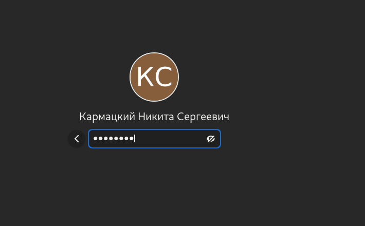
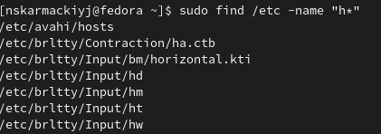
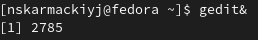

## РОССИЙСКИЙ УНИВЕРСИТЕТ ДРУЖБЫ НАРОДОВ

### Факультет физико-математических и естественных наук

### Кафедра прикладной информатики и теории вероятностей

&nbsp;

&nbsp;

&nbsp;

&nbsp;

&nbsp;

&nbsp;

&nbsp;

##### ОТЧЕТ
##### ПО ЛАБОРАТОРНОЙ РАБОТЕ №6
*дисциплина: Операционные системы*

&nbsp;

&nbsp;

&nbsp;

&nbsp;
&nbsp;
&nbsp;
&nbsp;
&nbsp;

&nbsp;

Студент: Кармацкий Никита Сергеевич

Группа: НФИбд-01-21

&nbsp;

&nbsp;

&nbsp;

&nbsp;
&nbsp;
&nbsp;
&nbsp;

##### Москва
2022 г.

&nbsp;
&nbsp;
&nbsp;
&nbsp;&nbsp;
&nbsp;&nbsp;
&nbsp;&nbsp;
&nbsp;&nbsp;
&nbsp;

### Цель работы:

Ознакомление с инструментами поиска файлов и фильтрации текстовых данных. Приобретение практических навыков: по управлению процессами (и заданиями), по проверке использования диска и обслуживанию файловых систем.

### Теоретическое введение

Перенаправление ввода-вывода

В системе по умолчанию открыто три специальных потока:

– stdin — стандартный поток ввода (по умолчанию: клавиатура), файловый дескриптор
0;

– stdout — стандартный поток вывода (по умолчанию: консоль), файловый дескриптор
1;

– stderr — стандартный поток вывод сообщений об ошибках (по умолчанию: консоль),
файловый дескриптор 2.

Конвейер (pipe) служит для объединения простых команд или утилит в цепочки, в которых результат работы предыдущей команды передаётся последующей. 

Синтаксис следующий:

- команда 1 | команда 2

#означает, что вывод команды 1 передастся на ввод команде 2

Команда find используется для поиска и отображения на экран имён файлов, соответствующих заданной строке символов.

Формат команды:

- find путь [-опции]

Найти в текстовом файле указанную строку символов позволяет команда grep.

Формат команды:

- grep строка имя_файла

Команда df показывает размер каждого смонтированного раздела диска.

Формат команды:

- df [-опции] [файловая_система]

Команда du показывает число килобайт, используемое каждым файлом или каталогом.

Формат команды:

- du [-опции] [имя_файла...]

Любую выполняющуюся в консоли команду или внешнюю программу можно запустить в фоновом режиме. Для этого следует в конце имени команды указать знак амперсанда &. 

Например:

- gedit &

Для завершения задачи необходимо выполнить команду

- kill %номер задачи

Команда ps используется для получения информации о процессах.

Формат команды:

- ps [-опции]

# Основные этапы выполнения работы

### 1. Осуществим вход в систему, используя соответствующее имя пользователя
Используем команду cp для копирования файлов и каталогов

Рис.1 Вошли в систему

### 2. Запишем в файл file.txt названия файлов, содержащихся в каталоге /etc. Допишем в этот же файл названия файлов, содержащихся в нашем домашнем каталоге

Для начала использовали команду ls /etc > file.txt

Для записи в конец файла использовали команду ls >> file.txt

Рис.2 Записали в текстовый файл навзвание фалов из каталогов

### 3. Выведем имена всех файлов из file.txt, имеющих расширение .conf, после чего запишем их в новый текстовой файл conf.txt.

Рис.3 Записали все имена файлов с раширение в .conf в новый текстовый файл

### 4. Определим какие файлы в нашем домашнем каталоге имеют имена, начинавшиеся с символа c. Предложим несколько вариантов, как это сделать

Рис.4 Опредили какие файлы начинаются с символа "c"

### 5. Выведем на экран (по странично) имена файлов из каталога /etc, начинающиеся с символа h.

Испозуем команду sudo find /etc -name "h*" -print | more

Рис.5 Вывели на экран имена файлов

### 6. Запустим в фоновом режиме процесс, который будет записывать в файл ~/logfile файлы, имена которых начинаются с log.

Используем команду find ~ -name "log*" -print>logfile

Рис.6 Запустили в фоновом режиме запись имен файлов

### 7. Удалим файл ~/logfile

Рис.7 Удалили файл

### 8. Запустим из консоли в фоновом режиме редактор gedit

Используем команду gedit &

Рис.8 Запустили в фоновом режиме редактор

### 9. Определим идентификатор процесса gedit, используя команду ps, конвейер и фильтр grep.

Использовали команду ps asu | grep gedit

Рис.9 Определили идентификатор процесса

### 10. Прочтём справку (man) команды kill, после чего использем её для завершения процесса gedit.

Прочитаем справку команды kill

Рис.10 Прочитали справку

Используем команду для завершения процесса

Рис.11 Используем kill для завершения процесса gedit

### 11. Выполним команды df и du, предварительно получив более подробную информацию об этих командах, с помощью команды man.

Рис.12 Используем команду **df**

Рис.13 Испольуем команду **du**

### 12. Воспользовавшись справкой команды find выведем имена всех директорий, имеющихся в вашем домашнем каталоге.

Используем команду find -type d

Рис.14 Вывели имена всех директорий

## Вывод: 

Мы ознакомлись с инструментами поиска файлов и фильтрации текстовых данных. а также приобрели практических навыков: по управлению процессами (и заданиями), по проверке использования диска и обслуживанию файловых систем.

## Контрольные вопросы:

*1. Какие потоки ввода вывода вы знаете*

**Ответ:** 1.	– stdin — стандартный поток ввода (клавиатура),

–	stdout — стандартный поток вывода (консоль),

–	stderr — стандартный поток вывод сообщений об ошибках на экран

*2. Объясните разницу между операцией > и >>.*

**Ответ:** Символ < используется для переназначения стандартного ввода команды.
Символ >> используется для присоединения данных в конец файла стандартного вывода команды(файл открывается в режиме добавления)

*3. Что такое конвейер?*

**Ответ:** Конвейер - способ связи между двумя программами.Конвейер (pipe) служит для объединения простых команд или утилит в цепочки, в которых результат работы предыдущей команды передается последующей. Синтаксис следующий: команда1 | команда 2

*4. Что такое PID и GID?*

**Ответ:** Process ID(PID) - идентификатор порожденного процесса. Group ID (GID-идентификация группы пользователей.

*5. Что такое процесс? Чем это понятие отличается от программы??*

**Ответ:**	Процесс - это программа, которая выполняется в отдельном виртуальном адресном пространстве. Когда пользователь регистрируется в системе, автоматически создается процесс, в котором выполняется оболочка (shell), например, /bin/bash.
Компьютерная программа сама по себе — это только пассивная совокупность инструкций, в то время как процесс — это непосредственное выполнение этих инструкций.

*6. Что такое задачи и какая команда позволяет ими управлять?*

**Ответ:** Запущенные фоном программы называются задачами (jobs). Ими можно управлять с помощью команды jobs, которая выводит список запущенных в данный момент задач. Для завершения задачи необходимо выполнить команду :
kill %номер задачи

*7. Найдите информацию об утилитах top и htop. Каковы их функции?*

**Ответ:**  **top** - интерактивный просмотрщик процессов. **htop** аналог **top**.

Программа **top** динамически выводит в режиме реального времени информации о работающей системе, т.е. о фактической активности процессов. По умолчанию она выдает задачи, наиболее загружающие процессор сервера, и обновляет список каждые две секунды.

*8. Назовите и дайте характеристику команде поиска файлов. Приведите примеры использования этой команды.**

**Ответ:** Для поиска файлов из командной строки вы можете использовать команду “find”. У этой команды следующий синтаксис:

- find путь [-опции]

*9. Можно ли по контексту (содержанию) найти файл? Если да, то как?*

**Ответ:** Да, можно. Для поиска файла по содержимому проще всего воспользоваться командой grep (вместо find).

Пример: 

- grep -r строка_поиска каталог

*10. Как определить объем свободной памяти на жёстком диске?*

**Ответ:** С помощью команды df. Она показывает размер каждого смонтированного раздела диска и свободное пространство.

Команда: 

- df

*11. Как определить объем вашего домашнего каталога?*

**Ответ:** Команда du показывает число килобайт, используемое каждым файлом или каталогом. 

Команда:

- du /home

*12. Как удалить зависший процесс?*

**Ответ:** Для завершения задачи необходимо выполнить команду:

- kill %номер задачи