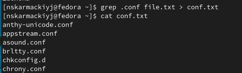
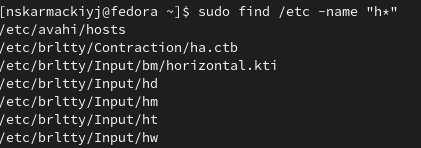
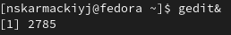
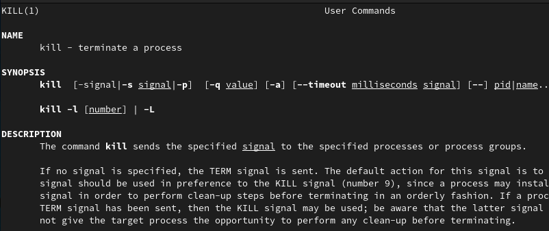

# Лабораторная работа №6

## "Поиск файлов. Перенаправление ввода-вывода. Просмотр запущенных процессов"

Выполнил: Кармацкий Никита Сергеевич

НФИбд-01-21

___

# Цель работы:

Ознакомление с инструментами поиска файлов и фильтрации текстовых данных. Приобретение практических навыков: по управлению процессами (и заданиями), по проверке использования диска и обслуживанию файловых систем.
___

# Основные этапы выполнения работы

___

## 1. Войдем в система

Рис.1 Вошли в систему
___

## 2. Запишем в файл file.txt названия файлов, содержащихся в каталоге /etc. Допишем в этот же файл названия файлов, содержащихся в нашем домашнем каталоге

Для начала использовали команду ls /etc > file.txt

Для записи в конец файла использовали команду ls >> file.txt

____

## 3. Выведем имена всех файлов из file.txt имеющих расширение .conf, использовав команду grep .conf file.txt Затем запишем их в новый текстовой файл conf.txt.

Рис.2 Записали все имена файлов с раширение в .conf в новый текстовый файл

___

### 4. Определим какие файлы в нашем домашнем каталоге имеют имена, начинавшиеся с символа c. Предложим несколько вариантов, как это сделать

### 5. Выведем на экран (по странично) имена файлов из каталога /etc, начинающиеся с символа h.

Испозуем команду sudo find /etc -name "h*" -print | more

Рис.3 Вывели на экран имена файлов

___

### 6. Запустим в фоновом режиме процесс, который будет записывать в файл ~/logfile файлы, имена которых начинаются с log.

Используем команду find ~ -name "log*" -print>logfile

### 7. Удалим файл ~/logfile

___

### 8. Запустим из консоли в фоновом режиме редактор gedit

Используем команду gedit &

Рис.4 Запустили в фоновом режиме редактор

____

### 9. Определим идентификатор процесса gedit, используя команду ps, конвейер и фильтр grep.

Использовали команду ps asu | grep gedit

___

### 10. Прочтем справку (man) команды kill, после чего используем её для завершения процесса gedit.

Рис. 5 Читаем справку о kill

### 11. Выполним команды df и du, предварительно получив более подробную информацию об этих командах, с помощью команды man.

___

### 12. Воспользовавшись справкой команды find выведем имена всех директорий, имеющихся в вашем домашнем каталоге.

Используем команду find -type d

___

## Вывод: 

Мы ознакомлись с инструментами поиска файлов и фильтрации текстовых данных. а также приобрели практических навыков: по управлению процессами (и заданиями), по проверке использования диска и обслуживанию файловых систем.

___
# Спасибо за внимание