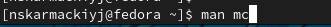
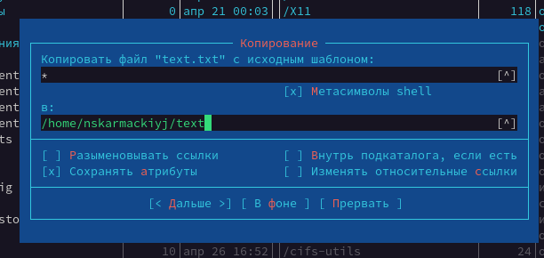
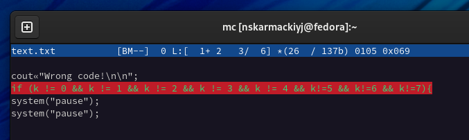

## РОССИЙСКИЙ УНИВЕРСИТЕТ ДРУЖБЫ НАРОДОВ

### Факультет физико-математических и естественных наук

### Кафедра прикладной информатики и теории вероятностей

&nbsp;

&nbsp;

&nbsp;

&nbsp;

&nbsp;

&nbsp;

&nbsp;

##### ОТЧЕТ
##### ПО ЛАБОРАТОРНОЙ РАБОТЕ №7
*дисциплина: Операционные системы*

&nbsp;

&nbsp;

&nbsp;

&nbsp;
&nbsp;
&nbsp;
&nbsp;
&nbsp;

&nbsp;

Студент: Кармацкий Никита Сергеевич

Группа: НФИбд-01-21

&nbsp;

&nbsp;

&nbsp;

&nbsp;
&nbsp;
&nbsp;
&nbsp;

##### Москва
2022 г.

&nbsp;
&nbsp;
&nbsp;
&nbsp;&nbsp;
&nbsp;&nbsp;
&nbsp;&nbsp;
&nbsp;&nbsp;
&nbsp;

### Цель работы:

Освоение основных возможностей командной оболочки Midnight Commander. Приобретение навыков практической работы по просмотру каталогов и файлов; манипуляций
с ними.

# Основные этапы выполнения работы

## Здания по mc

**1. Изучили информацию о mc, вызвав в командной строке man mc.**

Рис.1 Вызов информации о mc

&nbsp;

Рис.2 Информация о mc

&nbsp;

**2. Запустили из командной строки mc и изучили его структуру и меню.**

Рис.3 Меню mc

&nbsp;

**3. Выполнили несколько операций в mc, используя управляющие клавиши (операции
с панелями; выделение/отмена выделения файлов, копирование/перемещение файлов, получение информации о размере и правах доступа на файлы и/или каталоги
и т.п.)**

Подробно можно будет увидеть в скринкасте.

Рис.4 Копирование файлов

&nbsp;

**4. Выполнили основные команды меню левой (или правой) панели.**

Подробно можно будет увидеть в скринкасте.

Рис.5 Дерево каталогов

&nbsp;

**5. Используя возможности подменю Файл , выполнили:**

– просмотр содержимого текстового файла;
        

Рис.6 Просмотр содержимого файла

&nbsp;

– редактирование содержимого текстового файла (без сохранения результатов редактирования);

Рис.7 Редактирование текстового файла

&nbsp;

– создание каталога;

Рис.8 Создание каталога

&nbsp;

– копирование в файлов в созданный каталог

Рис.9 Копирование файлов

&nbsp;

**6. С помощью соответствующих средств подменю Команда осуществили:**

– поиск в файловой системе файла с заданными условиями (например, файла с расширением .c или .cpp, содержащего строку main);

Рис.10 Поиск в файловой системе файла

&nbsp;

– выбор и повторение одной из предыдущих команд;

Рис.11 История командной строки

&nbsp;

– переход в домашний каталог;

Рис.12 Переход в домашний каталог

&nbsp;

– анализ файла меню и файла расширений.

Рис.13 Анализ файла меню

&nbsp;

**7. Вызвали подменю Настройки . Освойте операции, определяющие структуру экрана mc (Full screen, Double Width, Show Hidden Files и т.д.)**

Рис.14 Освоили оперции, определяющие структуру экрана mc

&nbsp;

## 2. Задание по встроенному редактору mc

1. Создали текстовой файл text.txt.
   

Рис.15 Создали текстовой файл

&nbsp;

2. Открыли этот файл с помощью встроенного в mc редактора.
   

Рис.16 Открыли этот файл

&nbsp;

3. Вставили в открытый файл небольшой фрагмент текста, скопированный из любого другого файла или Интернета.

Использовали для этого комбинацию клавиш Ctrl+Shift+V

Рис.17 Вставили в открытый файл небольшой фрагмент текста

&nbsp;
   
4. Проделали с текстом следующие манипуляции, используя горячие клавиши:
   
    4.1. Удалили строку текста.

    Использовали для этого F8

    

    Рис.18 Удалили строку

    &nbsp;

    4.2. Выделили фрагмент текста и скопировали его на новую строку.

    Использовали для этого F5 и Ctrl+V+Shift

    

    Рис.19 Выделили фрагмент текста и скопировали его

    &nbsp;

    4.3. Выделили фрагмент текста и перенесли его на новую строку.

    Использовали для этого F6 и стрелочки на клавиатуре

    

    Рис.20 Выделили фрагмент текста и перенесли его

    &nbsp;

    4.4. Сохранили файл.

    Использовали для этого F2 

    

    Рис.21 Сохранили файл

    &nbsp;

    4.5. Отменили последнее действие.

    Использовали для этого Ctrl+u

    

    Рис.22 Отменили последнее действие

    &nbsp;

    4.6. Перешли в конец файла (нажав комбинацию клавиш) и написали некоторый текст.

    Использовали для этого Ctrl+End

    

    Рис.23 Перешли в конец файла и написали некоторый текст

    &nbsp;

    4.7. Перейшли в начало файла (нажав комбинацию клавиш) и написали некоторый текст.

    Использовали для этого Ctrl+Home

    

    Рис.24 Перейшли в начало файла и написали некоторый текст

    &nbsp;

    4.8. Сохранили и закрыли файл.

    Использовали для этого F2 и F10

    

    Рис.25 Сохранили и закрыли файл

    &nbsp;

5. Открыли файл с исходным текстом на некотором языке программирования (например C или Java)

Рис.26 Файл на некотором языке программирования

&nbsp;
   
6. Используя меню редактора, выключили подсветку синтаксиса

Использовали сочетание клавиш Ctrl+S

Рис.27 Выключили подсветку синтаксиса

&nbsp;

## Вывод: 

Мы освоили основные возможности командной оболочки Midnight Commander. Приобретели навыки практической работы по просмотру каталогов и файлов манипуляций с ними.

## Контрольные вопросы:

1. 
   Экран MC делится на четыре части. Почти весь зкран занят двумя панелями. По умолчанию, вторая строка снизу является командной, а в самой нижней отображается назначение функциональных клавиш. Самая верхняя строка - строка меню. Она может быть не видна, но при нажатии клавиши F9 или при щелчке мыши эта строка отображается в верхней части экрана.

   MC позволяет одновременно наблюдать содержимое двух каталогов. Одна из панелей является текущей (в этой панели находится выделитель). Практически все команды оперируют над текущей панелью. Хотя некоторые файловые операции, такие как Rename или Copy, по умолчанию используют каталог неактивной панели в качестве каталога назначения (при выполнении подобных команд всегда появляется запрос на подтверждение). Для более подробной информации просмотрите разделы 'ПАНЕЛИ', 'МЕНЮ Left', 'МЕНЮ Right' и 'МЕНЮ File'.

   Можно выполнять системные команды прямо из MC просто путём их набора на клавиатуре. Всё, что Вы набираете, появляется в командной строке, а при нажатии клавиши Enter, MC выполнит набранную строку. Просмотрите разделы 'КОМАНДНАЯ СТРОКА' и 'КЛАВИШИ РЕДАКТИРОВАНИЯ' для более подробной информации.

2. 
   Командные интерпретатор Shell и оболочка Midnight Commander имеют похожую структуру и многие одинаковые команды можно выполнить в обоих оболочках: · Системная информация · Поиск · Копирование

3. Меню левой панели 
   Подпункты меню: 
   · Список файлов показывает файлы в домашнем каталоге. 
   · Быстрый просмотр позволяет выполнить быстрый просмотр содержимого панели. 
   · Информация позволяет посмотреть информацию о файле или каталоге 
   · Командная оболочка Midnight Commander В меню каждой (левой или правой) панели можно выбрать · Формат списка: стандартный, ускоренный, расширенный и определённый пользователем. 
   · Порядок сортировки позволяет задать критерии сортировки при выводе списка файлов и каталогов: без сортировки, по имени, расширенный, время правки, время доступа, время изменения атрибута, размер, узел.

4. Меню файл Подпункты меню: 
   · Просмотр ( F3 ) позволяет посмотреть содержимое текущего файла без возможности редактирования. 
   · Просмотр вывода команды ( М + ! ) функция запроса команды с параметрами. 
   · Правка ( F4 ) открывает текущий (или выделенный) файл для его редактирования. 
   · Копирование ( F5 ) осуществляет копирование одного или нескольких файлов или каталогов в указанное пользователем во всплывающем окне место. 
   · Права доступа ( Ctrl-x c ) позволяет изменить права доступа к одному или нескольким файлам или каталогам. · Права доступа на файлы и каталоги 
   · Жёсткая ссылка ( Ctrl-x l ) позволяет создать жёсткую ссылку к текущему (или выделенному файлу . 
   · Символическая ссылка ( Ctrl-x s ) — позволяет создать символическую ссылку к текущему файлу
   · Владелец группы ( Ctrl-x o ) позволяет задать владельца и имя группы для одного или нескольких файлов или каталогов. 
   · Права (расширенные) позволяет изменить права доступа и владения для одного или нескольких файлов или каталогов. 
   · Переименование ( F6 ) позволяет переименовать один или несколько файлов или каталогов. 
   · Создание каталога ( F7 ) позволяет создать каталог. 
   · Удалить ( F8 ) позволяет удалить один или несколько файлов или каталогов. 
   · Выход ( F10 ) завершает работу mc.

5. Меню команда 
   Подпункты меню: 
   · Дерево каталогов отображает структуру каталогов системы. 
   · Поиск файла выполняет поиск файлов по заданным параметрам. 
   · Переставить панели меняет местами левую и правую панели. 
   · Сравнить каталоги ( Ctrl-x d ) сравнивает содержимое двух каталогов. 
   · Размеры каталогов отображает размер и время изменения каталога (по умол- чанию в mc размер каталога корректно не отображается). 
   · История командной строки выводит на экран список ранее выполненных в оболочке команд. 
   · Каталоги быстрого доступа ( Ctrl-\ ) при вызове выполняется быстрая смена текущего · каталога на один из заданного списка. · Восстановление файлов позволяет восстановить файлы на файловых систе- мах ext2 и ext3. 
   · Редактировать файл расширений позволяет задать с помощью определённого синтаксиса действия при запуске файлов с определённым расширением (напри- мер, какое программного обеспечение запускать для открытия или редактирова- ния файлов с расширением .c или .cpp). 
   · Редактировать файл меню позволяет отредактировать контекстное меню поль- зователя, вызываемое по клавише F2. 
   · Редактировать файл расцветки имён позволяет подобрать оптимальную для пользователя расцветку имён файлов в зависимости от их типа.

6. Меню настройки 
   Подпункты меню: 
   · Конфигурация позволяет скорректировать настройки работы с панелями. 
   · Внешний вид и Настройки панелей определяет элементы, отображаемые при вызове mc, а также цветовое выделение. 
   · Биты символов задаёт формат обработки информации локальным термина- лом. 
   · Подтверждение позволяет установить или убрать вывод окна с запросом подтверждения действий при операциях удаления и перезаписи файлов, а также при выходе из программы. 
   · Распознание клавиш диалоговое окно используется для тестирования функциональных клавиш, клавиш управления курсором и прочее. 
   · Виртуальные ФС настройки виртуальной файловой системы: тайм-аут, пароль и прочее.

7. Встроенные команды mc: 
   · F1 Вызов контекстно-зависимой подсказки. 
   · F2 Вызов пользовательского меню с возможностью создания and/or. 
   · F3 Просмотр содержимого файла, на который указывает подсветка в активной панели. 
   · F4 Вызов встроенного в mc редактора для изменения содержания файла, на который указывает подсветка в активной панели. 
   · F5 Копирование одного или нескольких файлов, отмеченных в первой (активной) панели, в каталог, отображаемый на второй панели. 
   · F6 Перенос одного или нескольких файлов, отмеченных в первой панели, в каталог, отображаемый на второй панели. 
   · F7 Создание подкаталога в каталоге, отображаемом в активной панели. 
   · F8 Удаление одного или нескольких файлов, отмеченных в первой панели файлов. 
   · F9 Вызов меню mc. 
   · F10 Выход из mc.
8.  Команды mc : 
    · Ctrl+y удалить строку. 
    · Ctrl+u отмена последней операции. 
    · Ins вставка/замена. 
    · F7 поиск. 
    · Shift+F7 повтор последней операции поиска. 
    · F4 замена файла. 
    · F3 первое нажатие начало выделения, второе это окончание выделения. 
    · F5 копировать выделенный фрагмент 
    · F6 переместить выделенный фрагмент. 
    · F8 удалить выделенный фрагмент. 
    · F2 записать изменения в файл. 
    · F10 выйти из редактора.

9.  Один из четырех форматов списка в Midnight Commander –пользовательский, определённый самим пользователем позволяет ему редактировать меню любого из двух списков. А меню пользователя – это меню, состоящее из команд, определенных пользователем. При вызове меню используется файл ~/.mc.menu. Если такого файла нет, то по умолчанию используется системный файл меню /usr/lib/mc/mc.menu. Все строки в этих файлах , начинающиеся с пробела или табуляции, являются командами, которые выполняются при выборе записи.
10. Когда мы выделяем файл не являющегося исполняемым, Midnight Commander сравнивает расширение выбранного файла с расширениями, прописанными в «файле расширений» ~/ mc.ext. Если в файле расширений найдется подраздел, задающий процедуры обработки файлов с данным расширением, то обработка файла производится в соответствии с заданными в этом подразделе командами и файлами: · файл помощи для MC. /usr/lib/mc.hlp · файл расширений, используемый по умолчанию. /usr/lib/mc/mc.ext · файл расширений, конфигурации редактора. $HOME/.mc.ext · системный инициализационный файл. /usr/lib/mc/mc.ini · фаил который содержит основные установки. /usr/lib/mc/mc.lib · инициализационный файл пользователя. Если он существует, то системный файл mc.ini игнорируется. $HOME/.mc.ini · этот файл содержит подсказки, отображаемые в нижней части экрана. /usr/lib/mc/mc.hint · системный файл меню MC, используемый по умолчанию. /usr/lib/mc/mc.menu · файл меню пользователя. Если он существует, то системный файл меню игнорируется. $HOME/.mc.menu · инициализационный файл пользователя. Если он существует, то системный файл mc.ini игнорируется. $HOME/.mc.tree
    
