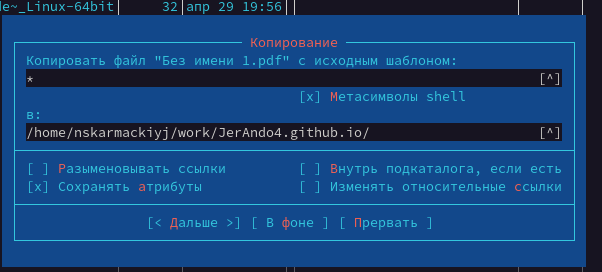
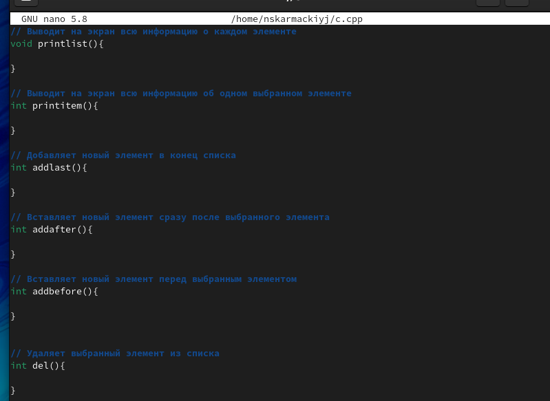

# Лабораторная работа №7

## "Командная оболочка Midnight Commander"

Выполнил: Кармацкий Никита Сергеевич

НФИбд-01-21

___

# Цель работы:

Освоение основных возможностей командной оболочки Midnight Commander. Приобретение навыков практической работы по просмотру каталогов и файлов; манипуляций с ними.
___

# Основные этапы выполнения работы

___

### 1. Изучили информацию о mc, вызвав в командной строке man mc.

Рис.1 Вызов информации о mc
___

### 2. Запустили из командной строки mc и изучили его структуру и меню.

Рис.3 Меню mc

____

### 3. Выполнили несколько операций в mc, используя управляющие клавиши (операциис панелями; выделение/отмена выделения файлов, копирование/перемещение файлов, получение информации о размере и правах доступа на файлы и/или каталоги и т.п.)

Рис.3 Копирование файлов

___

### 4. Выполнили основные задания с меню mc

- Выполнили основные команды меню левой (или правой) панели. 
  
- Используя возможности подменю Файл , выполнили основные действия.
  
- С помощью соответствующих средств подменю Команда осуществили основные задания в этом пункте.
  
- Вызвали подменю Настройки . Освоили операции, определяющие структуру экрана mc.

___

### 5. Создали текстовой файл text.txt

Рис.4 Вывели на экран имена файлов

___

### 6. Открыли этот файл с помощью встроенного в mc редактора и вставили в файл небольшой отрывок текста 

Рис.5 Открыли этот файл и вставили в файл

___

### 7. Проделайте с текстом следующие манипуляции, используя горячие клавиши:
- Удалили строку текста. Использовали для этого F8
  
- Выделили фрагмент текста и скопировали его на новую строку. Использовали для этого F5 и Ctrl+V+Shift
  
- Выделили фрагмент текста и перенесли его на новую строку. Использовали для этого F6 и стрелочки на клавиатуре

- Сохранили файл. Использовали для этого F2 

- Отменили последнее действие. Использовали для этого Ctrl+u

- Перешли в конец файла (нажав комбинацию клавиш) и написали некоторый текст. Использовали для этого Ctrl+End

- Перешли в начало файла (нажав комбинацию клавиш) и написали некоторый текст. Использовали для этого Ctrl+Home

___

### 8. Открыли файл с исходным текстом на некотором языке программирования

Рис.6 Открыли файл с исходным текстом на некотором языке программирования

___

____

### 9. Используя меню редактора, выключили подсветку синтаксиса

Использовали сочетание клавиш Ctrl+S

Рис.7 Выключили подсветку синтаксиса

___

___

## Вывод: 

Мы освоили основные возможности командной оболочки Midnight Commander. Приобретели навыки практической работы по просмотру каталогов и файлов манипуляций с ними.
___
# Спасибо за внимание