## РОССИЙСКИЙ УНИВЕРСИТЕТ ДРУЖБЫ НАРОДОВ

### Факультет физико-математических и естественных наук

### Кафедра прикладной информатики и теории вероятностей

&nbsp;

&nbsp;

&nbsp;

&nbsp;

&nbsp;

&nbsp;

&nbsp;

##### ОТЧЕТ
##### ПО ЛАБОРАТОРНОЙ РАБОТЕ №8
*дисциплина: Операционные системы*

&nbsp;

&nbsp;

&nbsp;

&nbsp;
&nbsp;
&nbsp;
&nbsp;
&nbsp;

&nbsp;

Студент: Кармацкий Никита Сергеевич

Группа: НФИбд-01-21

&nbsp;

&nbsp;

&nbsp;

&nbsp;
&nbsp;
&nbsp;
&nbsp;

##### Москва
2022 г.

&nbsp;
&nbsp;
&nbsp;
&nbsp;&nbsp;
&nbsp;&nbsp;
&nbsp;&nbsp;
&nbsp;&nbsp;
&nbsp;

### Цель работы:

Познакомиться с операционной системой Linux. Получить практические навыки работы с редактором vi, установленным по умолчанию практически во всех дистрибутивах.

# Основные этапы выполнения работы

## Часть 1

### 1. Создали каталог с именем ~/work/os/lab06.

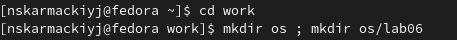

Рис.1 Создали каталог

### 2. Перешли во вновь созданный каталог.

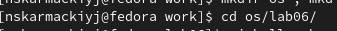

Рис.2 Перешли в каталог

### 3. Вызвали vi и создали файл hello.sh

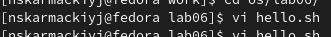

Рис.3 создали файл и вызвали редактор

### 4. Нажали клавишу [i] и ввели следующий текст:

    #!/bin/bash
    HELL=Hello
    function hello {
        LOCAL HELLO=World
        echo $HELLO
    }
    echo $HELLO
    hello

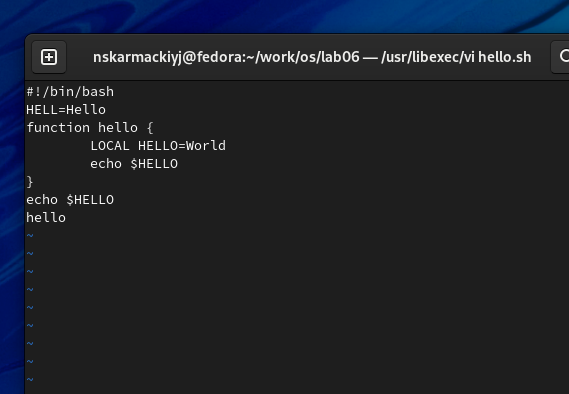

Рис.4 Ввели текст в файл

### 5. Нажали клавишу [Esc] для перехода в командный режим после завершения ввода текста.

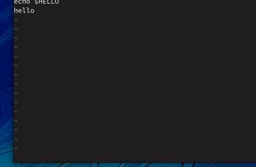

Рис.5 Нажали клавишу и перешли в командный режим

### 6. Нажали [:] для перехода в режим последней строки и внизу вашего экрана появился приглашение в виде двоеточия.

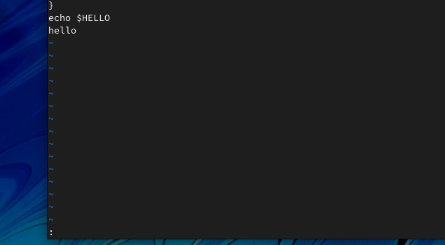

Рис.6 Появилось приглашение

### 7. Нажали w (записать) и q (выйти), а затем нажали клавишу [Enter] для сохранения вашего текста и завершения работы

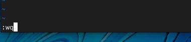

Рис.7 Записали и вышли из файла

### 8. Сделали файл исполняемым

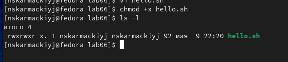

Рис.8 Сделали файл исполняемым 

## Часть 2

### 1. Вызвали vi на редактирование файла

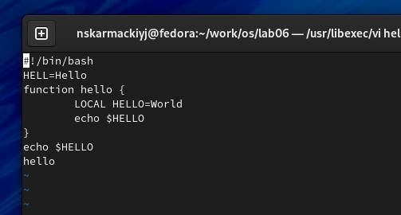

Рис.9 Снова вывали редактор для редактирования файла

### 2. Установили курсор в конец слова HELL второй строки

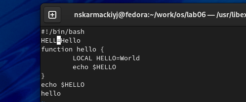

Рис.10 Установили курсор в конец слова HELL

### 3. Перешли в режим вставки и заменили на HELLO. Нажали [Esc] для возврата в командный режим

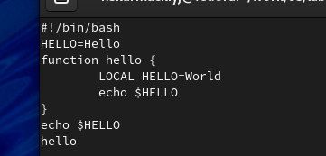

Рис.11 Заменили HELL на HELLO

### 4. Установили курсор на четвертую строку и стерли слово LOCAL

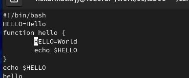

Рис.12 Стерли слово LOCAL

### 5. Перешли в режим вставки и набрали следующий текст: local, нажали [Esc] для возврата в командный режим.

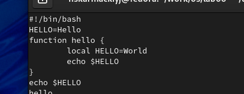

Рис.13 Стерли слово LOCAL

### 6. Установили курсор на последней строке файла. Вставили после неё строку, содержащую следующий текст: echo $HELLO

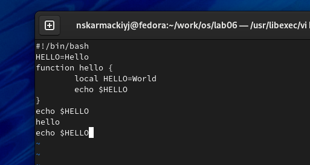

Рис.14 Вставили новую строку

### 7. Нажали [Esc] для перехода в командный режим.

Рис.16 Перешли в командный режим

### 8. Удалили последнюю строку

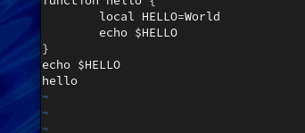

Рис.16 Удалили последнюю строку

### 9. Ввели команду отмены изменений [u] для отмены последней команды.

Рис.17 Отменили изменения

### 10. Введите символ [:] для перехода в режим последней строки. Запиcали произведённые изменения и выйдите из vi.

Рис.18 Сохранили изменения и вышли

## Вывод: 

Мы познакомились с операционной системой Linux. Получили практические навыки работы с редактором vi, установленным по умолчанию практически во всех дистрибутивах.

## Контрольные вопросы:

1. Командный режим позволяет управлять курсором и вводить команды редактирования. Режим вставки допускает производить ввод текста. При этом текст не будет восприниматься, как команды редактирования. Режим последней строки позволяет производить запись файла на диск и выходить из редактора Vi. Кроме того, используя этот режим, можно вводить дополнительные команды редактирования.
2. Если необходимо просто выйти Vi (без сохранения выполненных изменений), то необходимо в последней строке набрать символ q (или q!).
3. 0 (ноль) - перейти в начало строки; $ - перейти в конец строки; G - перейти в конец файла; nG - перейти на строку номер n.
4. Редактор vi предполагает, что слово - это строка символов, которая может включать в себя буквы, цифры и символы подчеркивания.
5. 0 (ноль) - перейти в начало строки; $ - перейти в конец строки; 6. Добавление / вставка текста а- добавить текст после курсора; А- добавить текст в конец строки; i- вставить текст перед курсором; ni- вставить текст n раз; I- вставить текст в началостроки. Вставка строки o-вставить строку под курсором; О- вставить строку над курсором. Удаление текста x- удалить один символ в буфер; dw- удалить одно слово в буфер; d$- удалить в буфер текст от курсора до конца строки; d0-(ноль) - удалить в буфер текст от начала строки до позиции курсора; dd- удалить в буфер одну строку; 10dd- удалить в буфер 10 строк. Отмена и повтор произведенных изменений u- отменить последнее изменение; - повторить последнее изменение. Копирование текста в буфер Y- скопировать строку в буфер; nY- скопировать n строк в буфер; yw- скопировать слово в буфер; Вставка текста из буфера p- вставить текст из буфера после курсора; P- вставить текст из буфера перед курсором. Замена текста cw - заменить слово; n cw - заменить n слов; c$- заменить текст от курсора до конца строки; r- заменить слово; R- заменить текст. Поиск текста / <текст> - произвести поиск вперед по тексту указанной строки символов <текст>; ? <текст> - произвести поиск назад по тексту указанной строки символов <текст>.
6. c$ - заменить текст от курсора до конца строки.
7. u- отменить последнее изменение
8. Kопирование и перемещение текста :n,m d-уничтожить строки с n по m пример: : 3,8d : i,j m k- переместить строки с i по j , начиная со строки k пример : : 4,9m12 : i,j t k- копировать строки с i по j на строку k пример: : 2,5 t 13 : i,j w <имя_файла>- записать строки с i по j в файл с именем <имя_файла> пример: : 5,9 <имя _файла>. Запись в файл и выход из редактора :w- записать измененныйтекст в файл на диске, не выходя из Vi; :w - записать измененный текст в новый файл с именем ; :w! <имя_файла>- записать измененный текст в файл с именем<имя_файла> ; - :wq- записать изменения в файл и выйти из Vi; :q- выйти из редактора Vi; :q!- выйти из редактора без записи; :e!- вернуться в командный режим, отменив все изменения,произведенные со времени последней записи
9. $ - перемещает курсор в конец строки.
10. Опции редактора Vi позволяют настроить рабочую среду. Для задания опций используется команда set (в режиме последней строки): : set all - вывести полный список опций; : set nu - вывести номера строк; : set list - вывести невидимые символы; : set ic - не учитывать при поиске, является ли символ прописным или строчным.
11. Нажатие клавиши ESC всегда переводит Vi в командный режим (это удобно, когда вы точно не помните в каком режиме находитесь). Если вы нажмете клавишу ESC, находясь в командном режиме, машина напомнит вам об этом, подав звуковой сигнал.
12. Командный –>вставки– >последняя строка (командная строка).