## РОССИЙСКИЙ УНИВЕРСИТЕТ ДРУЖБЫ НАРОДОВ

### Факультет физико-математических и естественных наук

### Кафедра прикладной информатики и теории вероятностей

&nbsp;

&nbsp;

&nbsp;

&nbsp;

&nbsp;

&nbsp;

&nbsp;

##### ОТЧЕТ
##### ПО ЛАБОРАТОРНОЙ РАБОТЕ №9
*дисциплина: Операционные системы*

&nbsp;

&nbsp;

&nbsp;

&nbsp;
&nbsp;
&nbsp;
&nbsp;
&nbsp;

&nbsp;

Студент: Кармацкий Никита Сергеевич

Группа: НФИбд-01-21

&nbsp;

&nbsp;

&nbsp;

&nbsp;
&nbsp;
&nbsp;
&nbsp;

##### Москва
2022 г.

&nbsp;
&nbsp;
&nbsp;
&nbsp;&nbsp;
&nbsp;&nbsp;
&nbsp;&nbsp;
&nbsp;&nbsp;
&nbsp;

### Цель работы:

Познакомиться с операционной системой Linux. Получить практические навыки работы с редактором Emacs.

# Основные этапы выполнения работы

### 1. Открыли emacs.

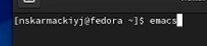

Рис.1 Открыли редактор

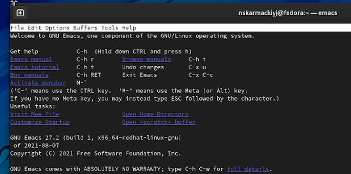

Рис.2 emacs

### 2. Создали файл lab07.sh с помощью комбинации Ctrl-x Ctrl-f (C-x C-f).

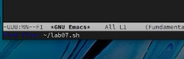

Рис.3 Создали файл

### 3. Набрали текст:

    #!/bin/bash
    HELL=Hello
    function hello {
        LOCAL HELLO=World
        echo $HELLO
    }
    echo $HELLO
    hello

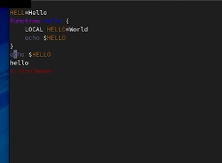

Рис.4 Ввели текст в файл

### 4. Сохранили файл с помощью комбинации Ctrl-x Ctrl-s (C-x C-s).

### 5. Проделади с текстом стандартные процедуры редактирования, каждое действие должно осуществили комбинацией клавиш.
    5.1. Вырезали одной командой целую строку (С-k).
    5.2. Вставили эту строку в конец файла (C-y).

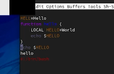

Рис.5 Вырезали и вставили целую строку

    5.3. Выделили область текста (C-space).
    5.4. Скопировали область в буфер обмена (M-w).

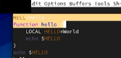

Рис.6 Выделили и скопировали область

    5.5. Вставили область в конец файла.
    
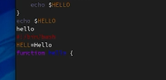

Рис.7 Вставили область

    5.6. Вновь выделили эту область и на этот раз вырезали её (C-w).
        
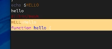

Рис.8 Выделили и вырезали область

    5.7. Отменили последнее действие (C-/).

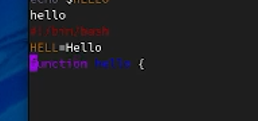

Рис.9 отменили последнее действие

### 6. Научились использовать команды по перемещению курсора.
    6.1. Переместили курсор в начало строки (C-a).

Рис.10 Переместили курсор в начало строки

    6.2. Переместили курсор в конец строки (C-e).

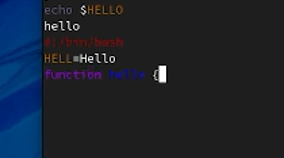

Рис.11 Переместили курсор в конец строки

    6.3. Переместили курсор в начало буфера (M-<).

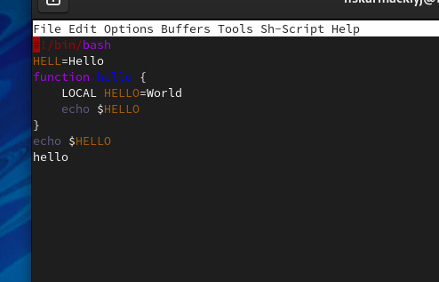

Рис.12 Переместили курсор в начало буфера

    6.4. Переместили курсор в конец буфера (M->).

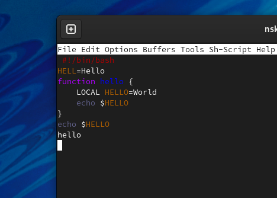

Рис.13 Переместили курсор в конец буфера

### 7. Управление буферами.
    7.1. Вывели список активных буферов на экран (C-x C-b).

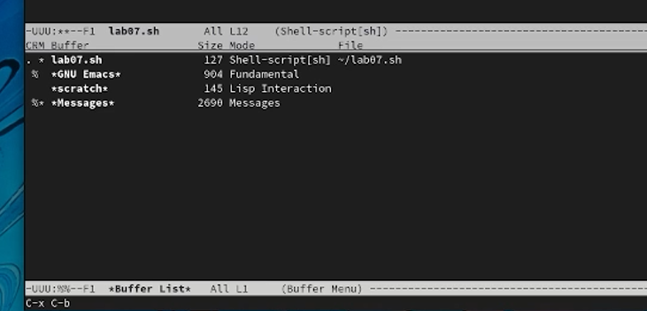

Рис.14 Вывели список буферов

    7.2. Переместились во вновь открытое окно (C-x) o со списком открытых буферов и переключились на другой буфер.

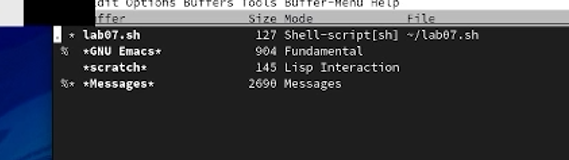

Рис.15 Переместились во вновь открытое окно

    7.3. Закрыли это окно (C-x 0).

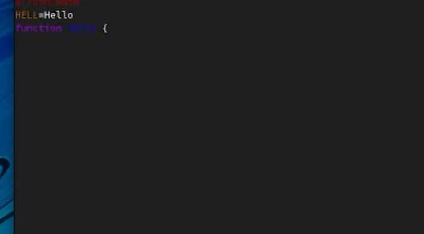

Рис.16 Закрыли это окно

    7.4. Теперь вновь переключились между буферами, но уже без вывода их списка на экран (C-x b).

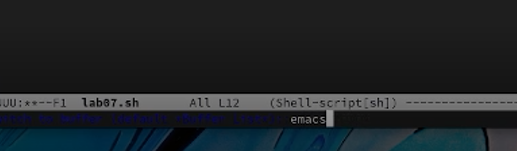

Рис.17 Переместились в буфер emacs с помощью командной строки

### 8. Управление окнами.
    8.1. Поделили фрейм на 4 части: разделили фрейм на два окна по вертикали (C-x 3), а затем каждое из этих окон на две части по горизонтали (C-x 2)

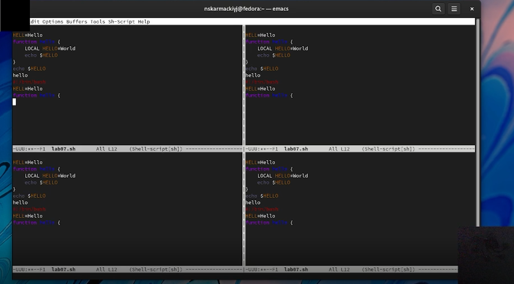

Рис.18 Поделили фрейм на 4 части

    8.2. В каждом из четырёх созданных окон открыли новый буфер (файл) и ввели несколько строк текста.

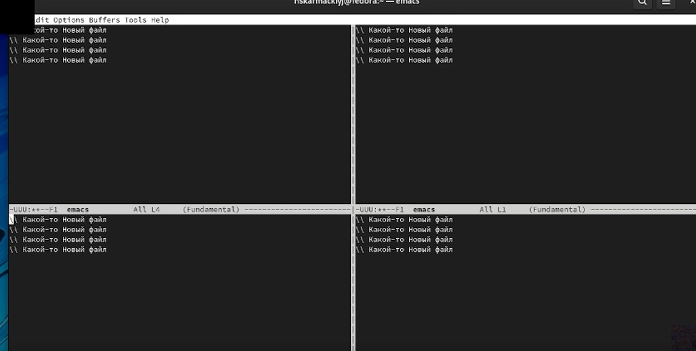

Рис.19 Открыли новый буфер и ввели нескольк строк

### 9. Режим поиска
    9.1. Переключились в режим поиска (C-s) и нашли несколько слов, присутствующих в тексте.

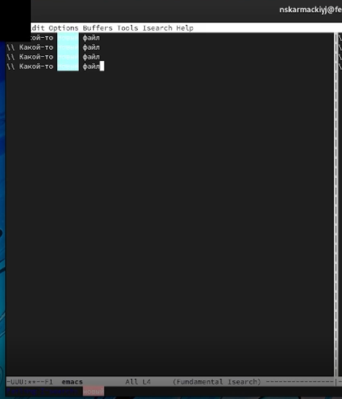

Рис.20 Нашли несколько слов

    9.2. Переключились между результатами поиска, нажимая C-s.

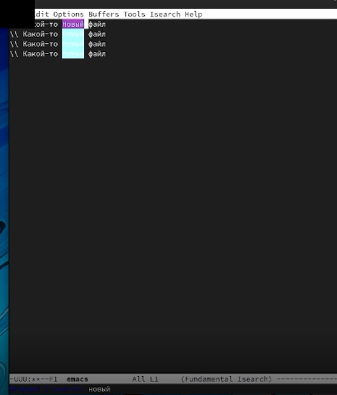

Рис.22 Переключились между результатами поиска

    9.3. Вышли из режима поиска, нажав C-g.

    9.4. Перешли в режим поиска и замены (M-%), ввели текст, который следует найти и заменить, нажали Enter , затем ввели текст для замены. После того как будут подсвечены результаты поиска, нажали ! для подтверждения замены.

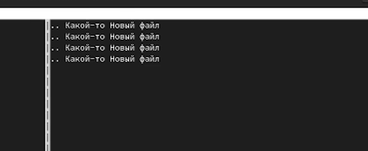

Рис.21 Заменили текст

    9.5. Испробовали другой режим поиска, нажав M-s o. Объясним, чем он отличается от обычного режима?

Отличается выводом искомого теста на экран. Он переводит курсор на конец найденного слова, а не выделяет его

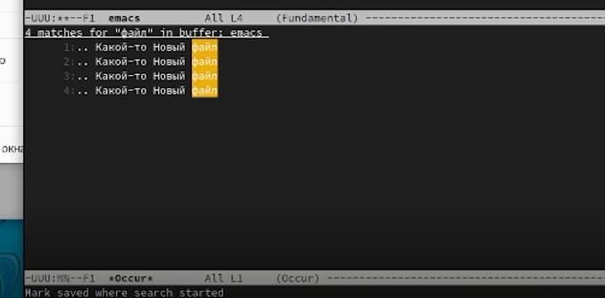

Рис.20 Другой вывод искомого текста

# Вывод
Мы познакомились с операционной системой Linux. Получили практические навыки работы с редактором emacs.

## Ответы на контрольные вопросы
1.	Emacs представляет собой мощный экранный редактор текста, написанный на языке высокого уровня Elisp.

2.	Для работы с emacs используется система меню и комбинаций клавиш. Используются сочетания c клавишами <ctrl> и <meta>. Сложности могут возникнуть так как на клавиатуре для IBM PC совместимых ПК клавиши <meta> нет, то вместо нее можно использовать <alt> или <esc>\verb . Для доступа к системе меню используйте клавишу F10.

3.	В терминологии emacs’а буфер- это область где мы набираем текст, а окно область, которая объединяет открытые буферы.

4.	Можно открыть больше 10 буферов в одном окне.

5.	Создаются по умолчанию при запуске emacs:
% *GNU Emacs* 844 Fundamental *scratch* 191 Lisp Interaction %* *Messages* 5257 Messages 
% *Quail Completions* 0 Fundamental

6.	Клавиши: Ctrl,C,Shift,\,] и <esc>,Ctrl,C Ctrl,Shift,\,]

7.	Разделите фрейм на два окна по вертикали C-x 3, окно на две части по горизонтали C-x 2

8.	В файле Emacs хранятся настройки редактора emacs.

9.	Kнопка backspace( стереть букву ) = функции C-k и ее можно переназначить.

10.	Emacs оказался намного удобнее. В нём больше функций, в нём интересно редактировать информацию.