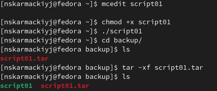
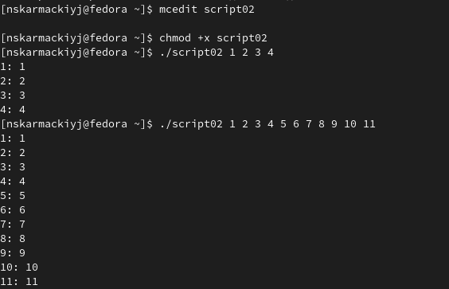
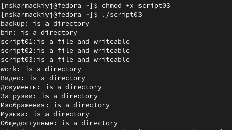
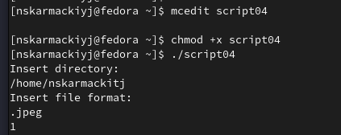

# Лабораторная работа №10

## "Программирование в командном процессоре ОС UNIX. Командные файлы"

Выполнил: Кармацкий Никита Сергеевич

НФИбд-01-21

___

# Цель работы:

Изучить основы программирования в оболочке ОС UNIX/Linux. Научиться писать небольшие командные файлы.
___

# Основные этапы выполнения работы

___

### 1. Написали скрипт, который при запуске будет делать резервную копию самого себя (то есть файла, в котором содержится его исходный код) в другую директорию backup в нашем домашнем каталоге. При этом файл будет архивироваться одним из архиваторов на выбор zip, bzip2 или tar. Способ использования команд архивации узнали, изучив справку.

Рис.1 Работа программы

___

### 2. Написали пример командного файла, обрабатывающего любое произвольное число аргументов командной строки, в том числе превышающее десять. Например, скрипт может последовательно распечатывать значения всех переданных аргументов.

Рис.2 Работа программы

___

### 3. Написали командный файл — аналог команды ls (без использования самой этой команды и команды dir). Требуется, чтобы он выдавал информацию о нужном каталоге и выводил информацию о возможностях доступа к файлам этого каталога.

Рис.3 Работа командного файла файла

___

### 4. Написали командный файл, который получает в качестве аргумента командной строки формат файла (.txt, .doc, .jpg, .pdf и т.д.) и вычисляет количество таких файлов в указанной директории. Путь к директории также передаётся в виде аргумента командной строки.

Рис.4 Работа командного файла файла

___

## Вывод: 

Мы изучили основы программирования в оболочке ОС UNIX/Linux. Научились писать небольшие командные файлы.
___

# Спасибо за внимание