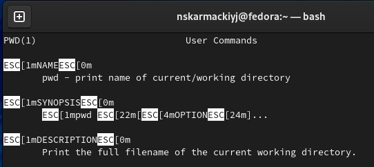

## РОССИЙСКИЙ УНИВЕРСИТЕТ ДРУЖБЫ НАРОДОВ

### Факультет физико-математических и естественных наук

### Кафедра прикладной информатики и теории вероятностей

&nbsp;

&nbsp;

&nbsp;

&nbsp;

&nbsp;

&nbsp;

&nbsp;

##### ОТЧЕТ
##### ПО ЛАБОРАТОРНОЙ РАБОТЕ №12
*дисциплина: Операционные системы*

&nbsp;

&nbsp;

&nbsp;
&nbsp;
&nbsp;
&nbsp;
&nbsp;

&nbsp;

Студент: Кармацкий Никита Сергеевич

Группа: НФИбд-01-21

&nbsp;

&nbsp;

&nbsp;

&nbsp;

&nbsp;
&nbsp;
&nbsp;

##### Москва
2022 г.

&nbsp;
&nbsp;
&nbsp;
&nbsp;&nbsp;
&nbsp;&nbsp;
&nbsp;&nbsp;
&nbsp;&nbsp;
&nbsp;

### Цель работы:

Изучить основы программирования в оболочке ОС UNIX. Научиться писать более сложные командные файлы с использованием логических управляющих конструкций и циклов

# Основные этапы выполнения работы

### 1. Написали командный файл, реализующий упрощённый механизм семафоров. Командный файл должен в течение некоторого времени t1 дожидаться освобождения ресурса, выдавая об этом сообщение, а дождавшись его освобождения, использовать его в течение некоторого времени t2<>t1, также выдавая информацию о том, что ресурс используется соответствующим командным файлом (процессом). Запустили командный файл в одном виртуальном терминале в фоновом режиме, перенаправив его вывод в другой (> /dev/tty#, где # — номер терминала куда перенаправляется вывод), в котором также запущен этот файл, но не фоновом, а в привилегированном режиме. Доработали программу так, чтобы имелась возможность взаимодействия трёх и более процессов

Напишем программу

Листинг программы:

    lockfile="./locking.file"

    exec {fn}>"$lockfile"

    if test -f "$lockfile"

    then

        while [ 1!=0 ]

        do

	        if flock -n ${fn}

	        then

	        echo "file was locked"

	        sleep 4

	        echo "unlocking"

	        flock -u ${fn}

	        else

	        echo "file already locked"

	        sleep 3

	        fi

        done  

    fi

Работа программы:

Рис.1 Работа программы

### 2. Реализовать команду man с помощью командного файла. Изучили содержимое каталога /usr/share/man/man1. В нем находятся архивы текстовых файлов, содержащих справку по большинству установленных в системе программ и команд. Каждый архив можно открыть командой less сразу же просмотрев содержимое справки. Командный файл должен получать в виде аргумента командной строки название команды и в виде результата выдавать справку об этой команде или сообщение об отсутствии справки, если соответствующего файла нет в каталоге man1.

Листинг программы:

    command=""

    while getopts :n: opt

    do

    case $opt in

    n)command="$OPTARG";;

    esac

    done

    if test -f "/usr/share/man/man1/$command.1.gz"

    then less /usr/share/man/man1/$command.1.gz

    else

    echo "No such command"

    fi

Работа программы:

Рис.2 Работа командного файла файла

Рис.3 Работа программы с несуществующей командой 

### 3. Используя встроенную переменную RANDOM, написали командный файл, генерирующий случайную последовательность букв латинского алфавита. Учли, что $RANDOM выдаёт псевдослучайные числа в диапазоне от 0 до 32767.

Листинг программы:

    echo $RANDOM | tr '0-9' 'a-zA-Z'

Работа программы:

Рис.4 Работа командного файла файла

# Вывод
Мы изучили основы программирования в оболочке ОС UNIX. Научились писать более сложные командные файлы с использованием логических управляющих конструкций и циклов

## Ответы на контрольные вопросы

1. Найдите синтаксическую ошибку в следующей строке: 

while [$1 != "exit"]

$1. Так же между скобками должны быть пробелы. В противном случае скобки и рядом стоящие символы будут восприниматься как одно целое

2. Как объединить (конкатенация) несколько строк в одну?

cat file.txt | xargs | sed -e 's/. /.\n/g'

3. Найдите информацию об утилите seq. Какими иными способами можно реализовать её функционал при программировании на bash?

seq - выдает последовательность чисел. Реализовать ее функционал можно командой for n in {1..5} do <КОМАНДА> done

4. Какой результат даст вычисление выражения $((10/3))?

5. Укажите кратко основные отличия командной оболочки zsh от bash.

Zsh очень сильно упрощает работу. Но существуют различия. Например, в zsh после for обязательно вставлять пробел, нумерация массивов в zsh начинается с 1 (что не особо удобно на самом деле). Если вы собираетесь писать скрипт, который легко будет запускать множество разработчиков, то я рекомендуется Bash. Если скрипты вам не нужны - Zsh (более простая работа с файлами, например)

6. Проверьте, верен ли синтаксис данной конструкции for ((a=1; a <= LIMIT; a++))

Верен

7. Сравните язык bash с какими-либо языками программирования. Какие преимущества у bash по сравнению с ними? Какие недостатки?

Bash позволяет очень легко работать с файловой системой без лишних конструкций (в отличи от обычного языка программирования). Но относительно обычных языков программирования bash очень сжат. Тот же Си имеет гораздо более широкие возможности для разработчика.