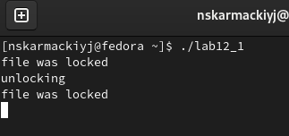
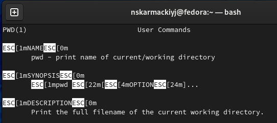
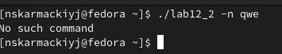
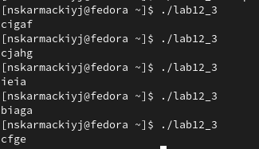

# Лабораторная работа №12

## "Программирование в командном процессоре ОС UNIX. Расширенное программирование"

Выполнил: Кармацкий Никита Сергеевич

НФИбд-01-21

___

# Цель работы:

Изучить основы программирования в оболочке ОС UNIX. Научиться писать более
сложные командные файлы с использованием логических управляющих конструкций
и циклов.

___

# Основные этапы выполнения работы

___

### 1. Написали командный файл, реализующий упрощённый механизм семафоров. Командный файл должен в течение некоторого времени t1 дожидаться освобождения ресурса, выдавая об этом сообщение, а дождавшись его освобождения, использовать его в течение некоторого времени t2<>t1, также выдавая информацию о том, что ресурс используется соответствующим командным файлом (процессом). Запустили командный файл в одном виртуальном терминале в фоновом режиме, перенаправив его вывод в другой (> /dev/tty#, где # — номер терминала куда перенаправляется вывод), в котором также запущен этот файл, но не фоновом, а в привилегированном режиме. Доработали программу так, чтобы имелась возможность взаимодействия трёх и более процессов

Рис.1 Работа программы

___

### 2. Реализовать команду man с помощью командного файла. Изучили содержимое каталога /usr/share/man/man1. В нем находятся архивы текстовых файлов, содержащих справку по большинству установленных в системе программ и команд. Каждый архив можно открыть командой less сразу же просмотрев содержимое справки. Командный файл должен получать в виде аргумента командной строки название команды и в виде результата выдавать справку об этой команде или сообщение об отсутствии справки, если соответствующего файла нет в каталоге man1.

___

Рис.2 Работа программы

Рис.3 Работа программы

___

### 3. Используя встроенную переменную RANDOM, написали командный файл, генерирующий случайную последовательность букв латинского алфавита. Учли, что $RANDOM выдаёт псевдослучайные числа в диапазоне от 0 до 32767.

Рис.3 Работа командного файла файла

___

## Вывод: 

Мы изучили основы программирования в оболочке ОС UNIX. Научились писать более сложные командные файлы с использованием логических управляющих конструкций и циклов
___

# Спасибо за внимание