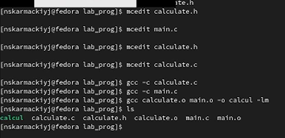
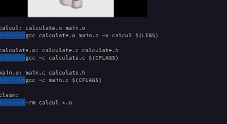
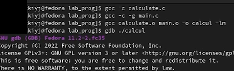
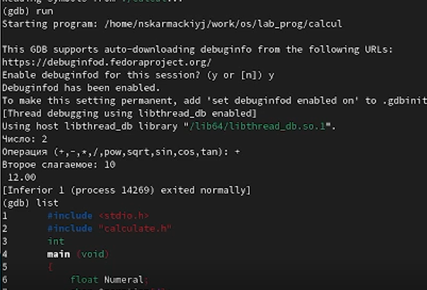

# Лабораторная работа №13

## "Средства, применяемые при разработке программного обеспечения в ОС типа UNIX/Linux"

Выполнил: Кармацкий Никита Сергеевич

НФИбд-01-21

___

### Цель работы:

Изучить основы программирования в оболочке ОС UNIX. Научится писать более сложные командные файлы с использованием логических управляющих конструкций и циклов.

____

# Основные этапы выполнения работы

___

1. Создание файлов для лабы 

Рис.1 Создание файлов для лабы 

___

2. Создание makefile 

Рис.2 Создание makefile 

___

3. Создание исполняемого файла

Рис.3 Создание исполняемого файла для работы

___

4. Работа с файлами

-

Рис.4 Работа с файлами с помощью gdb

___

# Вывод

Научились писать более сложные командные файлы с использованием логических управляющих конструкций и циклов.
___

# Спасибо за внимание