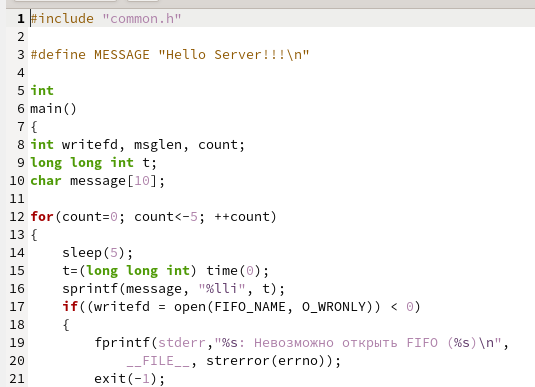

## РОССИЙСКИЙ УНИВЕРСИТЕТ ДРУЖБЫ НАРОДОВ

### Факультет физико-математических и естественных наук

### Кафедра прикладной информатики и теории вероятностей

&nbsp;

&nbsp;

&nbsp;

&nbsp;

&nbsp;

&nbsp;

&nbsp;

##### ОТЧЕТ
##### ПО ЛАБОРАТОРНОЙ РАБОТЕ №14
*дисциплина: Операционные системы*

&nbsp;

&nbsp;

&nbsp;
&nbsp;
&nbsp;
&nbsp;
&nbsp;

&nbsp;

Студент: Кармацкий Никита Сергеевич

Группа: НФИбд-01-21

&nbsp;

&nbsp;

&nbsp;

&nbsp;

&nbsp;
&nbsp;
&nbsp;

##### Москва
2022 г.

&nbsp;
&nbsp;
&nbsp;
&nbsp;&nbsp;
&nbsp;&nbsp;
&nbsp;&nbsp;
&nbsp;&nbsp;
&nbsp;

### Цель работы:

Приобретение практических навыков работы с именованными каналами.

# Основные этапы выполнения работы

### 1. Создали файлы common.h, server.c, client.c, client2.c. Скопировал основной код из теоретической части лабораторной работы и немного подкорректировал его

Рис.1 common.h

Рис.2 server.c

Рис.3 client.c

Рис.4 client2.c

### 2. Создали makefile

Рис.5 makefile

### 3.  Запустили makefile. Затем запустили server и запустили client в отдельном окне терминала

Рис.6 Работа командного файла файла server

Рис.7 Работа командного файла файла client

# Вывод
Мы научились пользоваться именованными каналами.

## Ответы на контрольные вопросы

# Контрольные вопросы.

1.	Именованные каналы отличаются от неименованных наличием идентификатора канала, который представлен как специальный файл (соответственно имя именованного канала — это имя файла).

2.	Создание неименованного канала из командной строки возможно командой pipe.

3.	Создание именованного канала из командной строки возможно с помощью mkfifo.

4.	Функция языка С, создающая неименованный канал:
int read(int pipe_fd, void *area, int cnt); int write(int pipe_fd, void *area, int cnt);
Первый аргумент этих вызовов - дескриптор канала, второй - указатель на область памяти, с которой происходит обмен, третий - количество байт. Оба вызова возвращают число переданных байт (или -1 - при ошибке).

5.	Функция языка С, создающая именованный канал:
int mkfifo (const char *pathname, mode_t mode);
Первый параметр — имя файла, идентифицирующего канал, второй параметр маска прав доступа к файлу. Вызов функции mkfifo() создаёт файл канала (с именем, заданным макросом FIFO_NAME):
mkfifo(FIFO_NAME, 0600);

6.	При чтении меньшего числа байтов, возвращается требуемое число байтов, остаток сохраняется для следующих чтений.
При чтении большего числа байтов, возвращается доступное число байтов 7. Запись числа байтов, меньшего емкости канала или FIFO, гарантированно
атомарно. Это означает, что в случае, когда несколько процессов одновременно записывают в канал, порции данных от этих процессов не перемешиваются.
При записи большего числа байтов, чем это позволяет канал или FIFO, вызов write(2) блокируется до освобождения требуемого места. При этом атомарность операции не гарантируется. Если процесс пытается записать данные в канал, не открытый ни одним процессом на чтение, процессу генерируется сигнал SIGPIPE, а вызов write(2) возвращает 0 с установкой ошибки (errno=ЕР1РЕ) (если процесс не установил обработки сигнала SIGPIPE, производится обработка по умолчанию -- процесс завершается).

8.	Два и более процессов могут читать и записывать в канал.

9.	Функция write записывает length байтов из буфера buffer в файл, определенный дескриптором файла fd. Эта операция чисто 'двоичная' и без буферизации. При единице возвращает действительное число байтов.
Функция write возвращает число действительно записанных в файл байтов или -1 при ошибке, устанавливая при этом errno.

10.	Строковая функция strerror - функция языков C/C++, транслирующая код ошибки, который обычно хранится в глобальной переменной errno, в сообщение об ошибке, понятном человеку.
