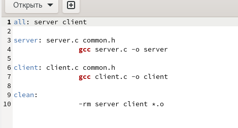

# Лабораторная работа №14

## "Именованные каналы"

Выполнил: Кармацкий Никита Сергеевич

НФИбд-01-21

___

# Цель работы:

Приобретение практических навыков работы с именованными каналами.

___

# Основные этапы выполнения работы

___

### 1. Создали файлы common.h, server.c, client.c, client2.c. Скопировал основной код из теоретической части лабораторной работы и немного подкорректировал его

### 2. Создали makefile

Рис.1 makefile

___

### 3.  Запустили makefile. Затем запустили server и запустили client в отдельном окне терминала

___

# Вывод
Мы научились пользоваться именованными каналами.
___

# Спасибо за внимание