## РОССИЙСКИЙ УНИВЕРСИТЕТ ДРУЖБЫ НАРОДОВ

### Факультет физико-математических и естественных наук

### Кафедра прикладной информатики и теории вероятностей

&nbsp;

&nbsp;

&nbsp;

&nbsp;

&nbsp;

&nbsp;

&nbsp;

##### ОТЧЕТ
##### ПО ИНДИВИДУАЛЬНОМУ ПРОЕКТУ. ЭТАП 1
*дисциплина: Операционные системы*

&nbsp;

&nbsp;

&nbsp;

&nbsp;
&nbsp;
&nbsp;
&nbsp;
&nbsp;

&nbsp;

Студент: Кармацкий Никита Сергеевич

Группа: НФИбд-01-21

&nbsp;

&nbsp;

&nbsp;

&nbsp;
&nbsp;
&nbsp;
&nbsp;

##### Москва
2022 г.

&nbsp;
&nbsp;
&nbsp;
&nbsp;&nbsp;
&nbsp;&nbsp;
&nbsp;&nbsp;
&nbsp;&nbsp;
&nbsp;

### Цель работы:

Размещение на Github pages заготовки для персонального сайта.

### Теоретическое введение

Установка программного обеспечения для Hugo

1.2.1 Linux

Ubuntu:

- sudo apt-get install go hugo

Fedora:

- sudo dnf install go hugo

1.2.2 Windows

Chocolatey

- choco install hugo-extended

1.2.3 Ручная установка

Если устанавливаемая в системе версия hugo меньше необходимой, тогда следует 

установить программу вручную.

Версию hugo можно посмотреть при помощи команды:

- hugo version

Следует скачать архив с репозитория: 

- https://github.com/gohugoio/hugo/releases

# Основные этапы выполнения работы

1. Скачиваем Hugo для Fedora: 

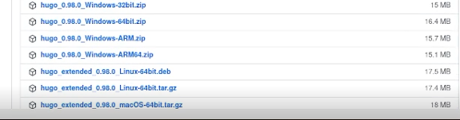

Рис.1 Скачиваем Hugo из Git Hub

2. Создаем папку для удобного использования Hugo

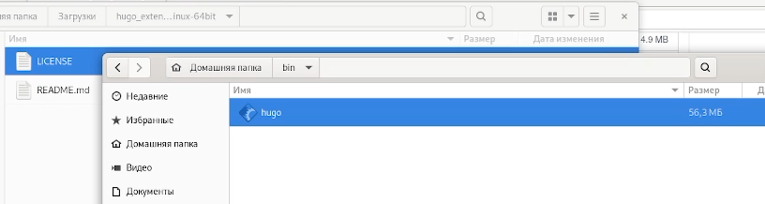

Рис.2 Создаем папку bin для HUGO

1. Используем шаблон данный нам в примере и сохряняем его в как новый
репозиторий.

Рис.3 Создаем новый репозиторий

4. Клонируем новый репозиторий локально в папку work

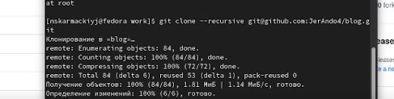

Рис.4 Клонируем новый репозиторий

5. Устанавливаем в локальный репозиторий HUGO

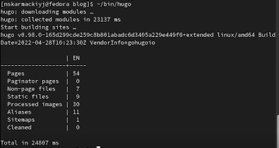

Рис.5 Устанавливаем HUGO

6. Создаем локальный сервер с помощью HUGO

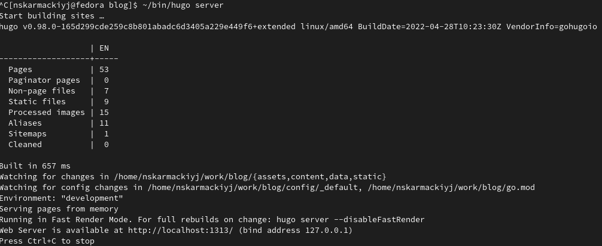

Рис.6 Создаем локальный сервер

7. Смотрим на наш сайт через локальный домейн 

Рис.6 Смотрим на наш сайт 

8. Создаем новый репозиторий с помощью Git Hub для Github pages

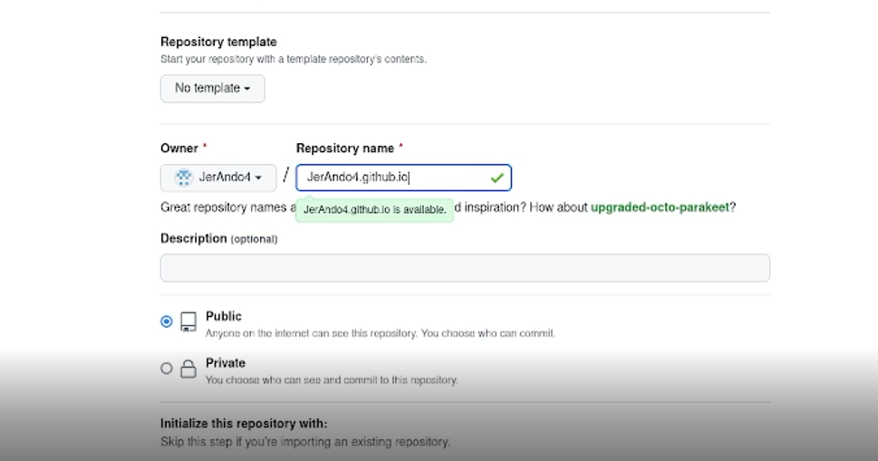

Рис.8 Создаем новый репозиторий

9. Клонируем новый репозиторий локально в папку work

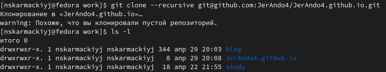

Рис.9 Копируем новый репозиторий

10. Создаем ветку Main и в нем README.md

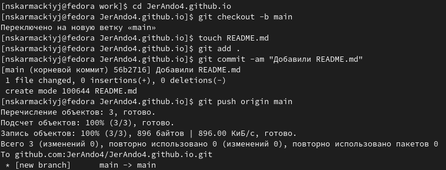

Рис.10 Выполняем действия с веткой main

11. Подключаем последний созданный репозиторий к папке public внутри папки work/blog 

Используем это для эффективного генерирования страниц блога 

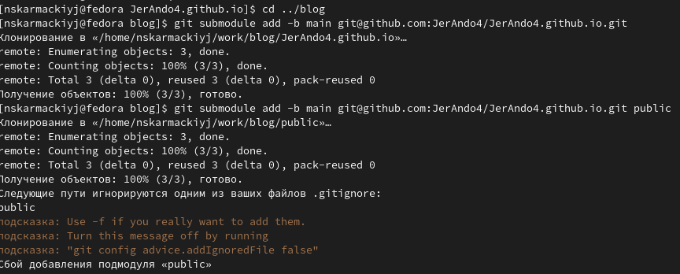

Рис.11 Подключаем репозиторий у папке public

12. Отключаем игнорирование public в .gitignore

Используемп команду mc для этого

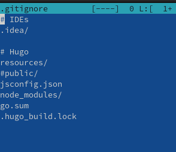

Рис.12 Отключили игнорирование public с помошью # 

13. Повторяем 11 пункт

Снова подключаем последний созданный репозиторий к папке public внутри папки work/blog

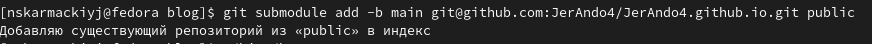

Рис.13 Подключаем репозиторий у папке public снова

14. Используем HUGO уже для нового репозитория 

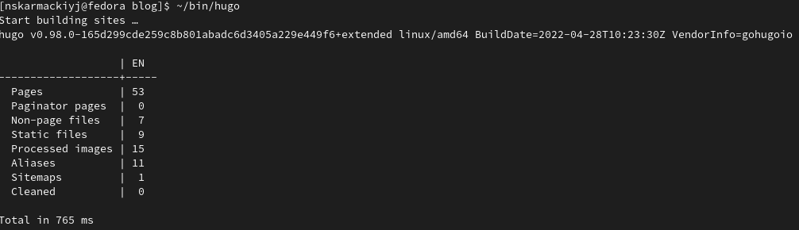

Рис.14 Снова используем hugo, но уже для нового репозитория

15. Проверям подключени каталога к репозиторию и добавляем комментарий

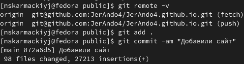

Рис.15 Проверяем подключение каталога

16. Прочитаем наш репозиторий 

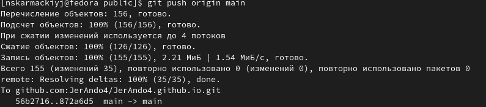

Рис.16 Узнаем о нашем репозитории все

17. Посмотрим на наш сайт через ссылку https://jerando4.github.io/ , по которой могут пройти все кто хочет

Рис.17 Смотрим на наш сайт уже не через локальный домейн

## Вывод: 

Мы создали сайт с помощью HUGO и консольных команд для Git Hub, а так же разместили заготовку сайта на Github pages.

