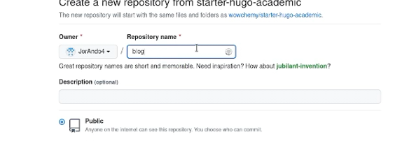
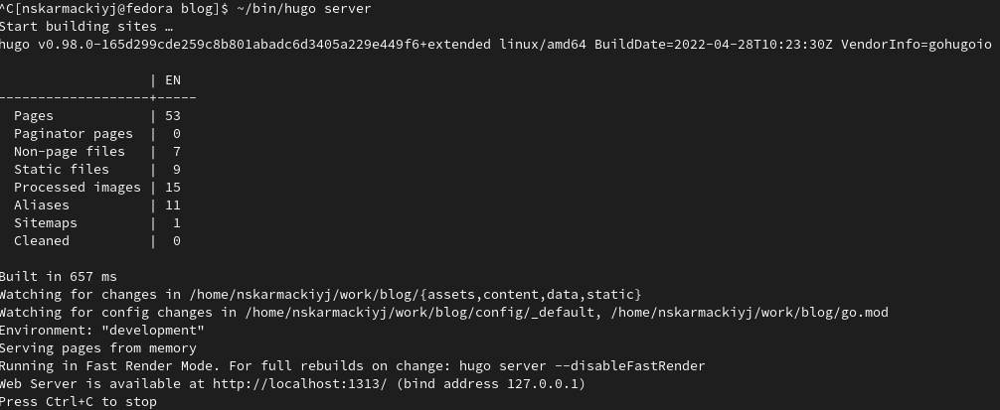
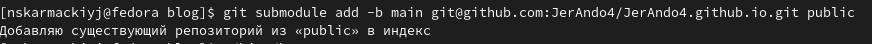
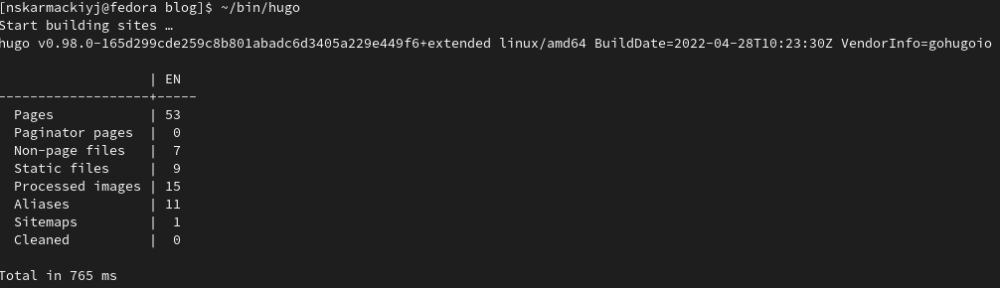

# Индивидуальный Проект

## "Этап 1"

Выполнил: Кармацкий Никита Сергеевич

НФИбд-01-21

___

# Цель работы:

Размещение на Github pages заготовки для персонального сайта.

# Поставленные задачи:

1. Размещение на Github pages заготовки для персонального сайта.
2. Установить необходимое программное обеспечение.
3. Разместить сайт на хостинге git.

___

# Установка программного обеспечения для Hugo

1.2.1 Linux

Ubuntu:

- sudo apt-get install go hugo

Fedora:

- sudo dnf install go hugo

___

1.2.2 Windows

Chocolatey

- choco install hugo-extended

1.2.3 Ручная установка

Если устанавливаемая в системе версия hugo меньше необходимой, тогда следует 

установить программу вручную.

___

Версию hugo можно посмотреть при помощи команды:

- hugo version

Следует скачать архив с репозитория: 

- https://github.com/gohugoio/hugo/releases
___

# Основные этапы выполнения работы

___

## 1. Скачиваем Hugo для Fedora: 

Рис.1 Скачиваем Hugo из Git Hub

___

## 2. Используем шаблон данный нам в примере и сохряняем его в как новый репозиторий.

Рис.2 Создаем новый репозиторий
___

## 3. Создаем локальный сервер с помощью HUGO

Рис.3 Создаем локальный сервер

___

## 4. Создаем новый репозиторий с помощью Git Hub для Github pages

Рис.4 Создаем новый репозиторий

___

## 5. Подключаем последний созданный репозиторий к папке public внутри папки work/blog 

Используем это для эффективного генерирования страниц блога 

Рис.5 Подключаем репозиторий у папке public

___

## 6. Снова подключаем последний созданный репозиторий к папке public внутри папки work/blog

Рис.6 Подключаем репозиторий у папке public снова

___

## 7. Используем HUGO уже для нового репозитория 

Рис.7 Снова используем hugo, но уже для нового репозитория

___

## 8. Посмотрим на наш сайт через ссылку https://jerando4.github.io/ , по которой могут пройти все кто хочет

Рис.8 Смотрим на наш сайт уже не через локальный домейн

___

## Вывод: 

Мы создали сайт с помощью HUGO и консольных команд для Git Hub, а так же разместили заготовку сайта на Github pages.

___
# Спасибо за внимание