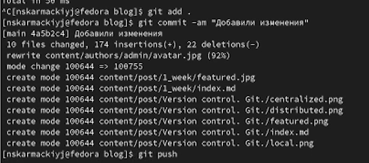

## РОССИЙСКИЙ УНИВЕРСИТЕТ ДРУЖБЫ НАРОДОВ

### Факультет физико-математических и естественных наук

### Кафедра прикладной информатики и теории вероятностей

&nbsp;

&nbsp;

&nbsp;

&nbsp;

&nbsp;

&nbsp;

&nbsp;

##### ОТЧЕТ
##### ПО ИНДИВИДУАЛЬНОМУ ПРОЕКТУ. ЭТАП 2
*дисциплина: Операционные системы*

&nbsp;

&nbsp;

&nbsp;

&nbsp;
&nbsp;
&nbsp;
&nbsp;
&nbsp;

&nbsp;

Студент: Кармацкий Никита Сергеевич

Группа: НФИбд-01-21

&nbsp;

&nbsp;

&nbsp;

&nbsp;
&nbsp;
&nbsp;
&nbsp;

##### Москва
2022 г.

&nbsp;
&nbsp;
&nbsp;
&nbsp;&nbsp;
&nbsp;&nbsp;
&nbsp;&nbsp;
&nbsp;&nbsp;
&nbsp;

### Цель работы:

Добавить к сайту данные о себе.

### План работы:

- Список добавляемых данных.
    - Разместить фотографию владельца сайта.
    - Разместить краткое описание владельца сайта (Biography).
    - Добавить информацию об интересах (Interests).
    - Добавить информацию от образовании (Education).
- Сделать пост по прошедшей неделе.
- Добавить пост на тему по выбору:
   -  Управление версиями. Git.

# Основные этапы выполнения работы

1. Список добавляемых данных:

   - Разместить фотографию владельца сайта.
  
    Для этого нам надо перекинуть нашу фотографию в каталог ~/work/blog/content/authors/admin

    

    Рис.1 Разместили нашу фотографию для сайта

    - Разместить краткое описание владельца сайта (Biography).
    
    Для начала поменяем имя и университет и нашу роль, все это делаем через обычный текстовый редактор

    

    Рис.2 Поменяли имя, университет и роль

    &nbsp;

    Меняем краткую биографию

    

    Рис.3 Поменяли краткую биографию

    &nbsp;

    Меняем основную биографию

    

    Рис.4 Поменяли основную биографию

    - Добавить информацию об интересах (Interests).

    Меняем чужие интересы на свои

    

    Рис.5 Поменяли интересы на сайте

    - Добавить информацию от образовании (Education).

    Ставим наш вуз РУДН вместо других вузов

    

    Рис.6 Поменяли информацию об образовании
2. Проверили, что наша информация отображается на локальном сервере

    

    Рис.7 Проверка сайта

3. Сделать пост по прошедшей неделе.
    Для начала открываем папку ~/work/blog/content/post и копируя первый самый пост на нашем сайте, делаем свой пост по прошедшей неделе.

    

    Рис.8 Написали свой пост через текстовый файл

4. Проверим, отображается ли наш пост в локальном сервере

    

    Рис.9 Проверили отображение поста

5. Добавить пост на тему по выбору:
    ***"Управление версиями. Git."***
   
   Для начала скопируем наш старый пост, и начнем переделывать информацию в нем, попутно добавляя картинки в пост

   

   Рис.10 Информационный пост

6. Проверим, появился ли у нас этот пост на локальном сервере

    

    Рис.11 Пост на нашем сайте

7. Перенесем все изменения на Git

    Для начала нам надо созранить весь каталог в репозиторий GIT

    

    Рис.12 Сохраняем все в репозиторий blog

    &nbsp;

    Потом проводим такие же действия только уже с папкой public, ведь она отвечает за изменения и работу онлайн сайта.

    

    Рис.13 Сохраняем все изменения в репозиторий jerando4.github.io

8. Проверяем все изменения в онлайн версии сайта

    Биография и т.д.:

    

    Рис.14 Биография и т.д. на нашем сайте

    &nbsp;

    Посты:

    

    Рис.15 Наши посты на сайте

## Вывод: 

Мы добавили на сайт информацию о себе и научились создавать посты. Добавили посты о прошедшей неделе и на тему "Управление версиями. Git."

