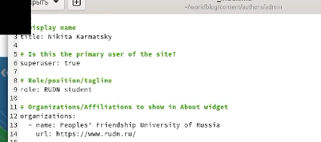
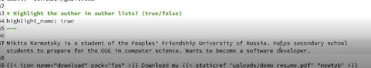
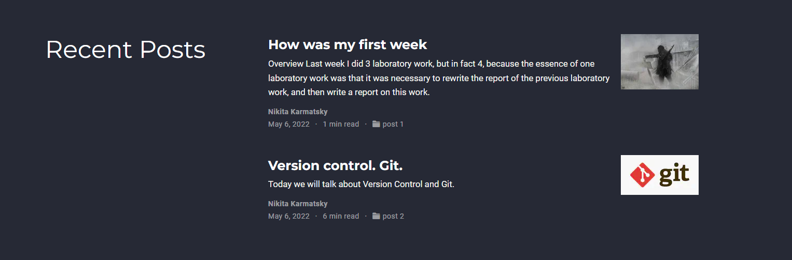

# Индивидуальный Проект

## "Этап 2"

Выполнил: Кармацкий Никита Сергеевич

НФИбд-01-21

___

# Цель работы:

Добавить к сайту данные о себе. Написать пост по прошедшей неделе и научный пост на выбор.

___

# Поставленные задачи:

- Список добавляемых данных.
    - Разместить фотографию владельца сайта.
    - Разместить краткое описание владельца сайта (Biography).
    - Добавить информацию об интересах (Interests).
    - Добавить информацию от образовании (Education).
- Сделать пост по прошедшей неделе.
- Добавить пост на тему по выбору:
   -  Управление версиями. Git.
___

# Основные этапы выполнения работы

___

## 1. Список добавляемых данных:

- Разместить фотографию владельца сайта.
  
    Для этого нам надо перекинуть нашу фотографию в каталог ~/work/blog/content/authors/admin

    

    Рис.1 Разместили нашу фотографию для сайта

___

- Разместить краткое описание владельца сайта (Biography).
    
    Для начала поменяем имя и университет и нашу роль, все это делаем через обычный текстовый редактор

    

    Рис.2 Поменяли имя, университет и роль

___

- Меняем основную биографию

    

    Рис.4 Поменяли основную биографию

___

- Добавить информацию об интересах (Interests).

    Меняем чужие интересы на свои

    

    Рис.5 Поменяли интересы на сайте

___

- Добавить информацию от образовании (Education).

    Ставим наш вуз РУДН вместо других вузов

    

    Рис.6 Поменяли информацию об образовании

___

## 3. Сделать пост по прошедшей неделе.
Для начала открываем папку ~/work/blog/content/post и копируя первый самый пост на нашем сайте, делаем свой пост по прошедшей неделе.

Рис.8 Написали свой пост через текстовый файл

___

___

## 5. Добавить пост на тему по выбору:
***"Управление версиями. Git."***
   
 Для начала скопируем наш старый пост, и начнем переделывать информацию в нем, попутно добавляя картинки в пост

  Рис.10 Информационный пост

___

   

  

___

## 8. Проверяем все изменения в онлайн версии сайта

Биография и т.д.:

Рис.14 Биография и т.д. на нашем сайте

___

&nbsp;

Посты:

Рис.15 Наши посты на сайте

___

## Вывод: 

Мы добавили на сайт информацию о себе и научились создавать посты. Добавили посты о прошедшей неделе и на тему "Управление версиями. Git."

___

# Спасибо за внимание
