## РОССИЙСКИЙ УНИВЕРСИТЕТ ДРУЖБЫ НАРОДОВ

### Факультет физико-математических и естественных наук

### Кафедра прикладной информатики и теории вероятностей

&nbsp;

&nbsp;

&nbsp;

&nbsp;

&nbsp;

&nbsp;

&nbsp;

##### ОТЧЕТ
##### ПО ИНДИВИДУАЛЬНОМУ ПРОЕКТУ. ЭТАП 3
*дисциплина: Операционные системы*

&nbsp;

&nbsp;

&nbsp;

&nbsp;
&nbsp;
&nbsp;
&nbsp;
&nbsp;

&nbsp;

Студент: Кармацкий Никита Сергеевич

Группа: НФИбд-01-21

&nbsp;

&nbsp;

&nbsp;

&nbsp;
&nbsp;
&nbsp;
&nbsp;

##### Москва
2022 г.

&nbsp;
&nbsp;
&nbsp;
&nbsp;&nbsp;
&nbsp;&nbsp;
&nbsp;&nbsp;
&nbsp;&nbsp;
&nbsp;

### Цель работы:

Добавить к сайту достижения. Сделать пост по прошедшей неделе и добавить пост по выбору.

### План работы:

- Список достижений.
    - Добавить информацию о навыках (Skills).
    - Добавить информацию об опыте (Experience).
    - Добавить информацию о достижениях (Accomplishments).
- Сделать пост по прошедшей неделе.
- Добавить пост на тему по выбору:
    - Легковесные языки разметки. 
    - Языки разметки. LaTeX.
    - Язык разметки Markdown.

# Основные этапы выполнения работы

1. Список добавляемых данных:

   - Добавить информацию о навыках (Skills).
  
        Для этого нам надо открыть файл skills.md в каталоге ~/work/blog/content/home

        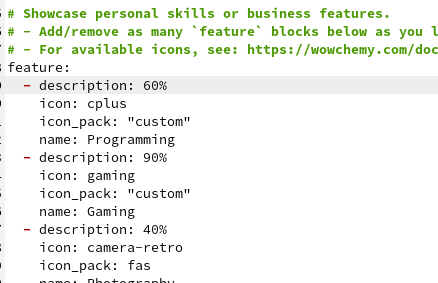

        Рис.1 Меняем информацию о своих навыках

        &nbsp;

    - Добавить информацию об опыте (Experience).
    
        Для этого нам надо открыть файл experience.md в каталоге ~/work/blog/content/home

        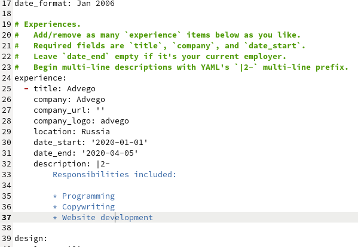

        Рис.2 Меняем информацию о своем опыте

        &nbsp;

    - Добавить информацию о достижениях (Accomplishments).

        Для этого нам надо открыть файл accomplishments.md в каталоге ~/work/blog/content/home

        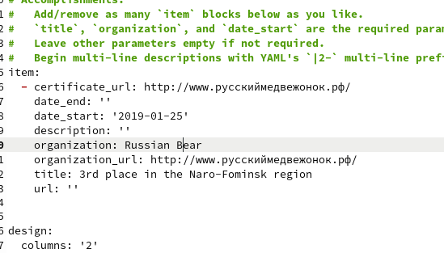

        Рис.3 Поменяли информацию о своих достижениях

        &nbsp;

2. Проверили, что наша информация отображается на локальном сервере

    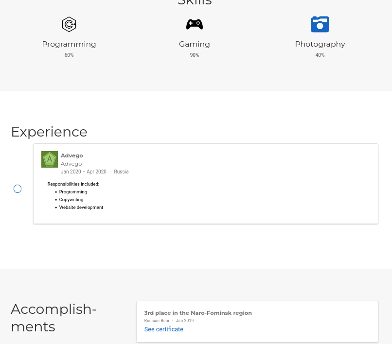

    Рис.4 Проверка сайта

    &nbsp;

3. Сделать пост по прошедшей неделе.
   
    Для начала открываем папку ~/work/blog/content/post и копируя первый самый пост на нашем сайте, делаем свой пост по прошедшей неделе.

    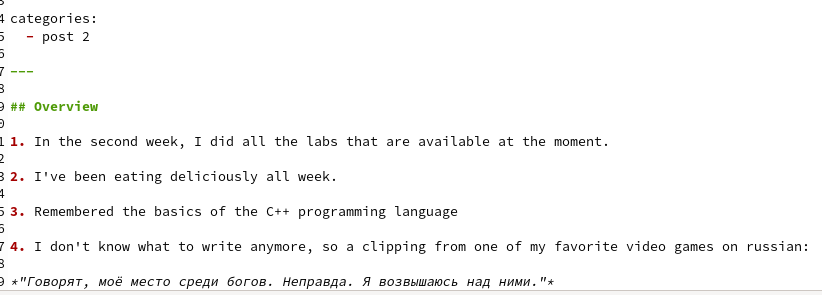

    Рис.5 Написали свой пост через текстовый файл

    &nbsp;

4. Проверим, отображается ли наш пост в локальном сервере

    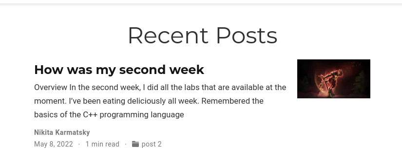

    Рис.6 Проверили отображение поста

    &nbsp;

5. Добавить пост на тему по выбору:
    ***"Язык разметки Markdown."***
   
   Для начала скопируем наш старый пост, и начнем переделывать информацию в нем.

   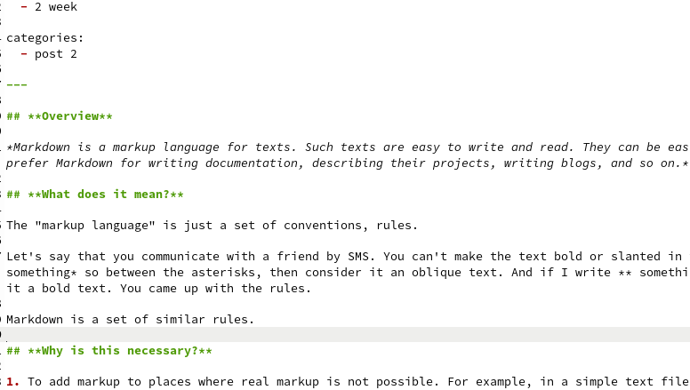

   Рис.7 Информационный пост

   &nbsp;

6. Проверим, появился ли у нас этот пост на локальном сервере

    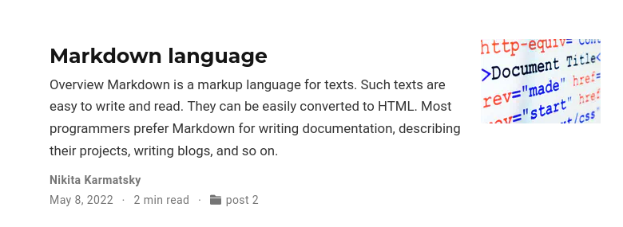

    Рис.8 Пост на нашем сайте

    &nbsp;

7. Перенесем все изменения на Git

    Для начала нам надо созранить весь каталог в репозиторий GIT

    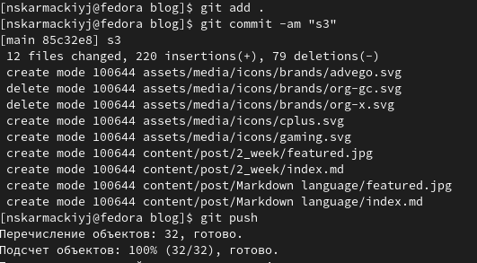

    Рис.9 Сохраняем все в репозиторий blog

    &nbsp;

    Потом проводим такие же действия только уже с папкой public, ведь она отвечает за изменения и работу онлайн сайта.

    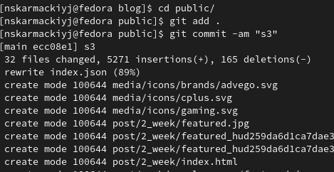

    Рис.10 Сохраняем все изменения в репозиторий jerando4.github.io

    &nbsp;

8. Проверяем все изменения в онлайн версии сайта

    Навыки и т.д.:

    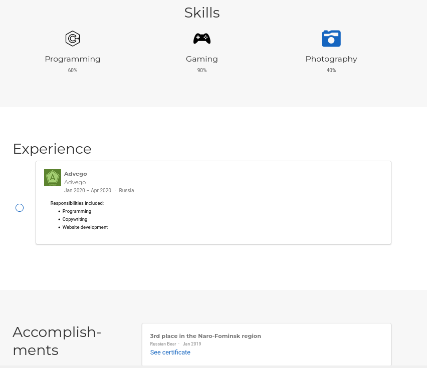

    Рис.14 Навыки и т.д. на нашем сайте

    &nbsp;

    Посты:

    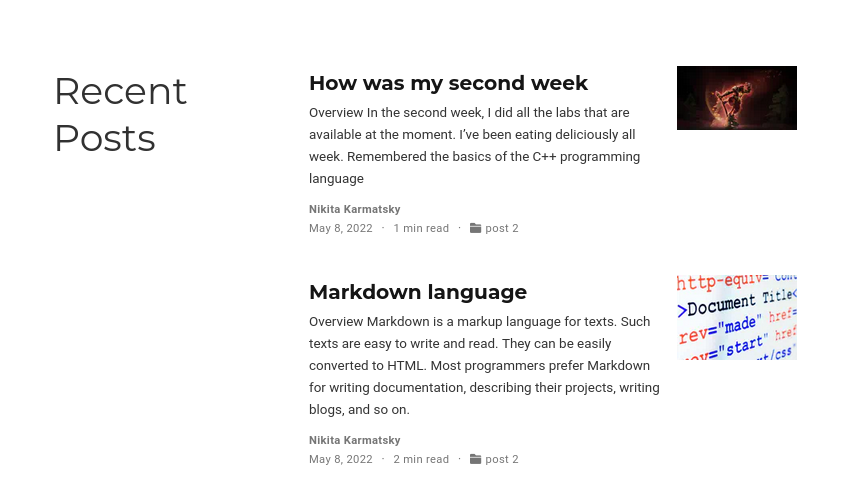

    Рис.15 Наши посты на сайте

## Вывод: 

Добавиили к сайту достижения. Сделали пост по прошедшей неделе и добавить пост по выбору "Язык разметки Markdown".

