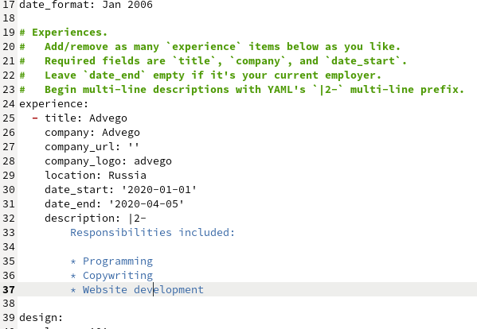
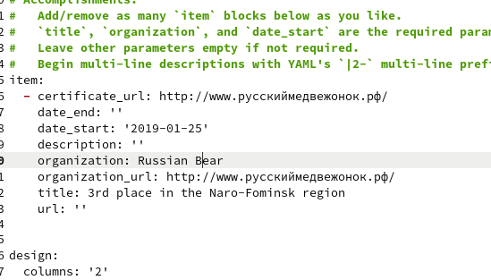
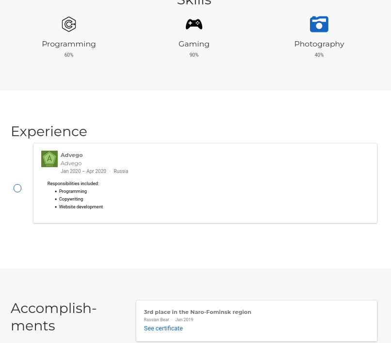
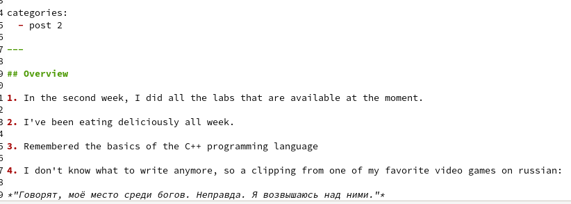
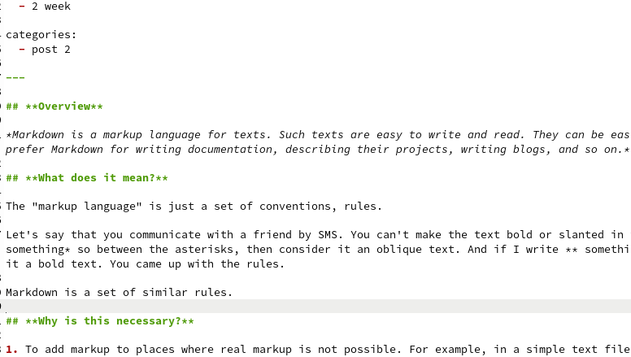

# Индивидуальный Проект

## "Этап 3"

Выполнил: Кармацкий Никита Сергеевич

НФИбд-01-21

___

# Цель работы:

Добавить к сайту данные о себе. Написать пост по прошедшей неделе и научный пост на выбор.

___

# Поставленные задачи:

- Список достижений.
    - Добавить информацию о навыках (Skills).
    - Добавить информацию об опыте (Experience).
    - Добавить информацию о достижениях (Accomplishments).
- Сделать пост по прошедшей неделе.
- Добавить пост на тему по выбору:
    - Легковесные языки разметки. 
    - Языки разметки. LaTeX.
    - Язык разметки Markdown.

___

# Основные этапы выполнения работы

1. **Список добавляемых данных:**

- Добавить информацию о навыках (Skills).
  
    Для этого нам надо открыть файл skills.md в каталоге ~/work/blog/content/home

    

    Рис.1 Меняем информацию о своих навыках

___

- Добавить информацию об опыте (Experience).
    
    Для этого нам надо открыть файл experience.md в каталоге ~/work/blog/content/home

    

    Рис.2 Меняем информацию о своем опыте

___

- Добавить информацию о достижениях (Accomplishments).

    Для этого нам надо открыть файл accomplishments.md в каталоге ~/work/blog/content/home

    

    Рис.3 Поменяли информацию о своих достижениях

___

2. **Проверили, что наша информация отображается на локальном сервере**

Рис.4 Проверка сайта

___

____

1. **Сделать пост по прошедшей неделе.**
   
    Для начала открываем папку ~/work/blog/content/post и копируя первый самый пост на нашем сайте, делаем свой пост по прошедшей неделе.

___

Рис.5 Написали свой пост через текстовый редактор

___

4. **Добавить пост на тему по выбору:**
   
    ***"Язык разметки Markdown."***
   
   Для начала скопируем наш старый пост, и начнем переделывать информацию в нем.

___

   

   Рис.6 Информационный пост

___

5. **Перенесем все изменения на Git**

    Для начала нам надо созранить весь каталог в репозиторий GIT

    

    Рис.7 Сохраняем все в репозиторий blog

___

Потом проводим такие же действия только уже с папкой public, ведь она отвечает за изменения и работу онлайн сайта.

Рис.8 Сохраняем все изменения в репозиторий jerando4.github.io

___

6. **Проверяем все изменения в онлайн версии сайта**

    Навыки и т.д.:

    Рис.9 Навыки и т.д. на нашем сайте

___

___

Посты:

Рис.10 Наши посты на сайте

___

## Вывод: 

Добавили к сайту достижения. Сделали пост по прошедшей неделе и добавили пост по выбору "Язык разметки Markdown".

___

# Спасибо за внимание
