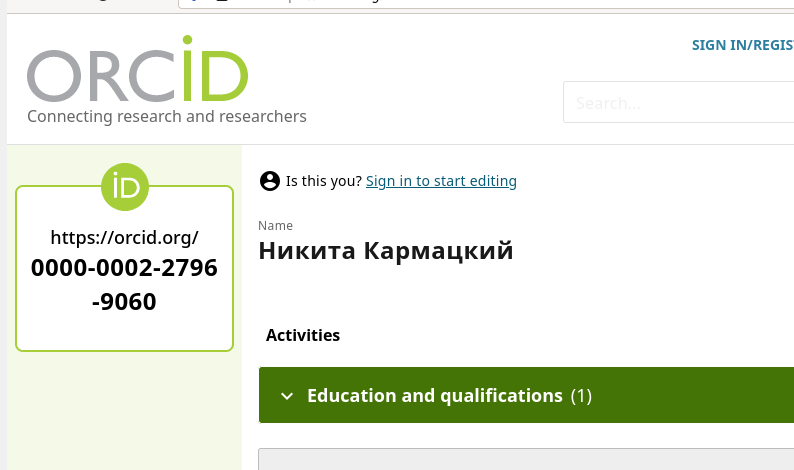
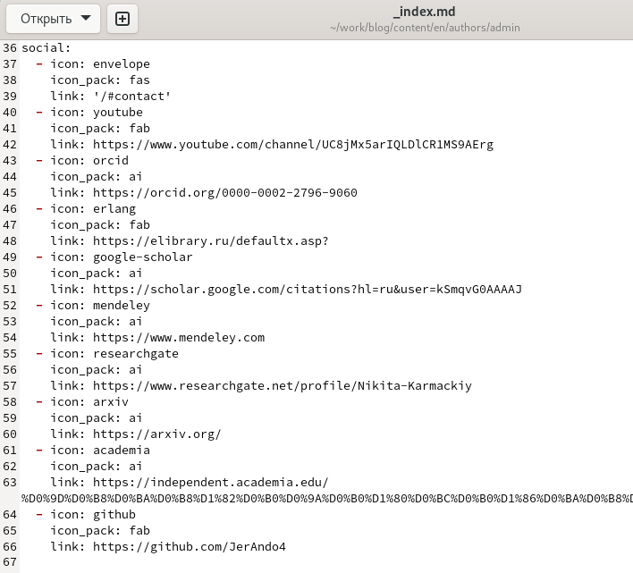
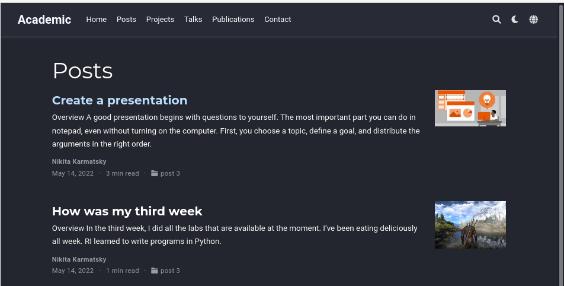

## РОССИЙСКИЙ УНИВЕРСИТЕТ ДРУЖБЫ НАРОДОВ

### Факультет физико-математических и естественных наук

### Кафедра прикладной информатики и теории вероятностей

&nbsp;

&nbsp;

&nbsp;

&nbsp;

&nbsp;

&nbsp;

&nbsp;

##### ОТЧЕТ
##### ПО ИНДИВИДУАЛЬНОМУ ПРОЕКТУ. ЭТАП 4
*дисциплина: Операционные системы*

&nbsp;

&nbsp;

&nbsp;

&nbsp;
&nbsp;
&nbsp;
&nbsp;
&nbsp;

&nbsp;

Студент: Кармацкий Никита Сергеевич

Группа: НФИбд-01-21

&nbsp;

&nbsp;

&nbsp;

&nbsp;
&nbsp;
&nbsp;
&nbsp;

##### Москва
2022 г.

&nbsp;
&nbsp;
&nbsp;
&nbsp;&nbsp;
&nbsp;&nbsp;
&nbsp;&nbsp;
&nbsp;&nbsp;
&nbsp;

### Цель работы:

Добавить к сайту ссылки на научные и библиометрические ресурсы. Сделать пост по прошедшей неделе и добавить пост по выбору.

### План работы:

- Зарегистрироваться на соответствующих ресурсах и разместить на них ссылки на сайте:
  
     - eLibrary : https://elibrary.ru/

     - Google Scholar : https://scholar.google.com/
  
     - ORCID : https://orcid.org/
  
     - Mendeley : https://www.mendeley.com/
  
     - ResearchGate : https://www.researchgate.net/
  
     - Academia.edu : https://www.academia.edu/
  
     - arXiv : https://arxiv.org/
  
     - github : https://github.com/
  
- Сделать пост по прошедшей неделе.

- Добавить пост на тему по выбору:
     - Оформление отчёта.
  
     - Создание презентаций.
  
     - Работа с библиографией.

# Основные этапы выполнения работы

## 1. Добавили к сайту ссылки на научные и библиометрические ресурсы.

   - eLibrary 
  
   - Google Scholar

        

        Рис.1 Наш акканут 

        &nbsp;

    - ORCID

        

        Рис.2 Наш акканут 

        &nbsp;

    - Mendeley

    - ResearchGate

        

        Рис.3 Наш акканут 

        &nbsp;

    - Academia. edu
  
    - arXiv
  
    - github 
        

        Рис.4 Наш акканут 

## 2. Добавляем ссылки с иконками в файл index.md, который расположен в папке work/blog/content/authors/admin

Рис.5 Добавляем ссылки и иконки в файл

&nbsp;

## 3. Проверяем, появились ли они на сайте

Рис.6 Проверка иконок

&nbsp;

## 4. Добавляем пост по прошедшей неделе:
   
Для начала скопируем наш старый пост, и начнем переделывать информацию в нем.

Рис.7 Пост по прошедшей неделе

&nbsp;

## 5. Добавляем пост по выбору на тему:

- <h4> Создание презентаций

Рис.8 Пост на нашем сайте

&nbsp;

## 6. Проверим, отображается ли наш посты в локальном сервере

Рис.9 Проверили отображение постов

&nbsp;

## 7. Перенесем все изменения на Git

Рис.10 Сохраняем все изменения в каталоге blog и public для GitHub

&nbsp;

## 8. Проверяем все изменения в онлайн версии сайта
 
Отображение иконок под фотографией:

Рис.11 Навыки и т.д. на нашем сайте

&nbsp;

Отображение наших постов на сайте:

Рис.12 Наши посты на сайте

&nbsp;

Пост по рошедшей неделе:

Рис.13 Навыки и т.д. на нашем сайте

&nbsp;

Пост по выбору:

Рис.14 Наши посты на сайте

## Вывод: 

Добавили к сайту ссылки на научные и библиометрические ресурсы. Сделали пост по прошедшей неделе и добавить пост по выбору "Создание презентаций".

