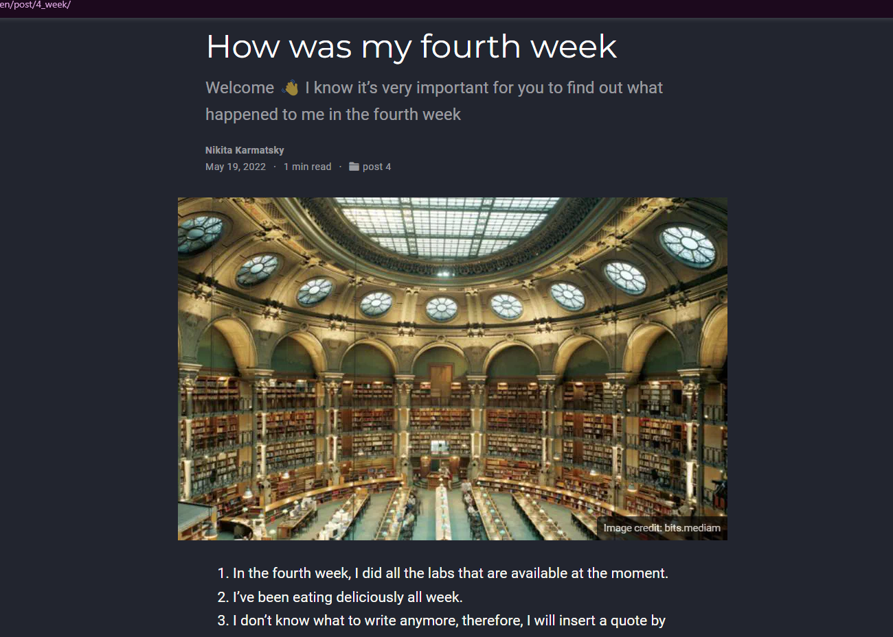

## РОССИЙСКИЙ УНИВЕРСИТЕТ ДРУЖБЫ НАРОДОВ

### Факультет физико-математических и естественных наук

### Кафедра прикладной информатики и теории вероятностей

&nbsp;

&nbsp;

&nbsp;

&nbsp;

&nbsp;

&nbsp;

&nbsp;

##### ОТЧЕТ
##### ПО ИНДИВИДУАЛЬНОМУ ПРОЕКТУ. ЭТАП 5
*дисциплина: Операционные системы*

&nbsp;

&nbsp;

&nbsp;

&nbsp;
&nbsp;
&nbsp;
&nbsp;
&nbsp;

&nbsp;

Студент: Кармацкий Никита Сергеевич

Группа: НФИбд-01-21

&nbsp;

&nbsp;

&nbsp;

&nbsp;
&nbsp;
&nbsp;
&nbsp;

##### Москва
2022 г.

&nbsp;
&nbsp;
&nbsp;
&nbsp;&nbsp;
&nbsp;&nbsp;
&nbsp;&nbsp;
&nbsp;&nbsp;
&nbsp;

### Цель работы:

Добавить с сайту все остальные элементы и записи к проектам. Сделать пост по прошедшей неделе и добавить пост по выбору.

### План работы:

- Сделать записи для персональных проектов.
  
- Сделать пост по прошедшей неделе.

- Добавить пост на тему по выбору:
  
     - Языки научного программирования

# Основные этапы выполнения работы

## 1. Сделали записи для персональных проектов.

Первая запись была посвящена языку программирования C++

Наша запись:

Рис.1 Пост по C++

Вторая запись была посвящена языку программирования Python

Наша запись:

Рис.2 Пост по Python

## 4. Добавляем пост по прошедшей неделе:
   
Для начала скопируем наш старый пост, и начнем переделывать информацию в нем.

Рис.3 Пост по прошедшей неделе

&nbsp;

## 5. Добавляем пост по выбору на тему:

- <h4> Языки научного программирования

Рис.4 Пост на нашем сайте

&nbsp;

## 6. Проверим, отображается ли наш посты в локальном сервере

Рис.5 Проверили отображение постов

&nbsp;

## 7. Перенесем все изменения на Git

Рис.6 Сохраняем все изменения в каталоге blog и public для GitHub

&nbsp;

## 8. Проверяем все изменения в онлайн версии сайта
 
Отображение записей для проектов:

Рис.7 Навыки и т.д. на нашем сайте

&nbsp;

Отображение наших постов на сайте:

Рис.8 Наши посты на сайте

&nbsp;

Пост по прошедшей неделе:

Рис.9 Навыки и т.д. на нашем сайте

&nbsp;

Пост по выбору:

Рис.10 Наши посты на сайте

## Вывод: 

Добавили с сайту все остальные элементы и записи для проектов. Сделали пост по прошедшей неделе и добавить пост по выбору "Языки научного программирования".