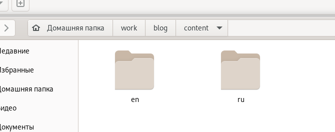

## РОССИЙСКИЙ УНИВЕРСИТЕТ ДРУЖБЫ НАРОДОВ

### Факультет физико-математических и естественных наук

### Кафедра прикладной информатики и теории вероятностей

&nbsp;

&nbsp;

&nbsp;

&nbsp;

&nbsp;

&nbsp;

&nbsp;

##### ОТЧЕТ
##### ПО ИНДИВИДУАЛЬНОМУ ПРОЕКТУ. ЭТАП 6
*дисциплина: Операционные системы*

&nbsp;

&nbsp;

&nbsp;

&nbsp;
&nbsp;
&nbsp;
&nbsp;
&nbsp;

&nbsp;

Студент: Кармацкий Никита Сергеевич

Группа: НФИбд-01-21

&nbsp;

&nbsp;

&nbsp;

&nbsp;
&nbsp;
&nbsp;
&nbsp;

##### Москва
2022 г.

&nbsp;
&nbsp;
&nbsp;
&nbsp;&nbsp;
&nbsp;&nbsp;
&nbsp;&nbsp;
&nbsp;&nbsp;
&nbsp;

### Цель работы:

Размещение двуязычного сайта на Github. Сделать пост по прошедшей неделе и добавить пост по выбору.

### План работы:

Размещение двуязычного сайта на Github:

- Сделать поддержку английского и русского языков.
- Разместить элементы сайта на обоих языках.
- Разместить контент на обоих языках.
- Сделать пост по прошедшей неделе.
- Добавить пост на тему по выбору (на двух языках).

# Основные этапы выполнения работы

## 1. Сделаем поддержку английского и русского языков.

Рис.1 Добавляем второй язык

Рис.2 Разделяем папку с контентом на 2 языка

Рис.3 Переводим все на русский язык

## 2. Добавляем пост по выбору на тему и пост по прошедшей неделе

Рис.4 Посты на нашем сайте на английском

Рис.5 Посты на нашем сайте на русском

&nbsp;

## 3. Проверяем все изменения в онлайн версии сайта
 
Отображение перевода для проектов:

Рис.6 Инофрмация о нас на анлийском языке

Рис.7 Инофрмация о нас на русском языке

&nbsp;

Отображение наших постов на сайте:

Рис.8 Наши посты на сайте на анлийском языке

Рис.9 Наши посты на сайте на русском языке

## Вывод: 

Сделали сайт двуязычным и добавили пост по прошедшей неделе и пост по выбору.