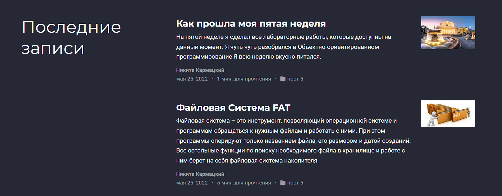

# Индивидуальный Проект

## "Этап 6"

Выполнил: Кармацкий Никита Сергеевич

НФИбд-01-21

___

# Цель работы:

Размещение двуязычного сайта на Github. Сделать пост по прошедшей неделе и добавить пост по выбору.

___

# Поставленные задачи:

Размещение двуязычного сайта на Github:

- Сделать поддержку английского и русского языков.
- Разместить элементы сайта на обоих языках.
- Разместить контент на обоих языках.
- Сделать пост по прошедшей неделе.
- Добавить пост на тему по выбору (на двух языках).

___

# Основные этапы выполнения работы

___

## 1. Сделали поддержку английского и русского языков.

## 2. Добавляем пост по прошедшей неделе:
   
Для начала скопируем наш старый пост, и начнем переделывать информацию в нем.

## 3. Добавляем пост по выбору на тему:

- Файловая система FAT

___

## 4. Проверим, отображается ли наш посты в локальном сервере

Рис.1 Проверили отображение постов на новом языке

___

## 5. Перенесем все изменения на Git

## 6. Проверяем все изменения в онлайн версии сайта

___

## Вывод: 

Размещение двуязычного сайта на Github. Сделать пост по прошедшей неделе и добавить пост по выбору.